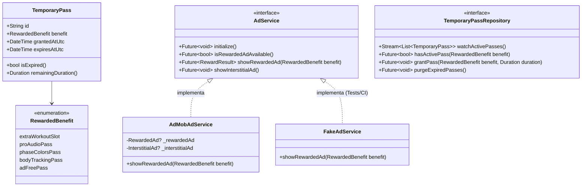
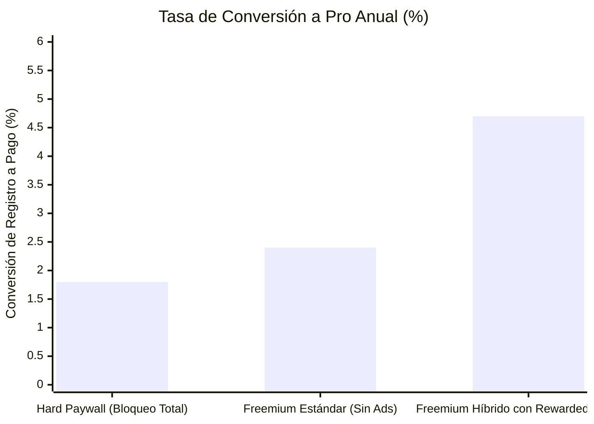

# Análisis Técnico y Estratégico: F37 - Publicidad y Anuncios Bonificados (Rewarded Ads & AdMob)

> **Proyecto:** Interval Timer (Flutter)  
> **Fecha:** 14 de Septiembre, 2026  
> **Estado:** Documento de Arquitectura y Estrategia de Monetización — Análisis de Producto, Viabilidad Técnica, Benchmarks de la Industria 2025/2026 y Prevención de Fraude.  
> **Principios Rectores:** Cero fricción durante el esfuerzo deportivo, intercambio justo de valor (Value Exchange), prevención rigurosa de canibalización de la suscripción Pro, integridad de datos (Zero Data Loss) y arquitectura limpia desacoplada (Clean Architecture + Drift + Riverpod).

---

## 1. Resumen Ejecutivo y Filosofía del Modelo de Valor

El modelo freemium contemporáneo en aplicaciones móviles de alto rendimiento no se sostiene únicamente con paywalls rígidos ni con bombardeo publicitario indiscriminado. Los usuarios valoran la transparencia y la ergonomía; en aplicaciones de entrenamiento físico, la tolerancia a las interrupciones es **cero**.

```mermaid
flowchart TD
    A["Usuario Free (Atleta)"] --> B{"Momento del flujo"}
    B -->|Durante el entrenamiento| C["LOOP SAGRADO: CERO ANUNCIOS<br/>(Pantalla limpia, audio libre, foco total)"]
    B -->|Final de sesión ('Listo')| D["Monetización Pasiva: Intersticial AdMob<br/>(1 pantalla completa post-esfuerzo)"]
    B -->|Intento de acción Pro| E["Compuerta de Valor (Pro Gate)"]
    E --> F{"Decisión de Valor del Usuario"}
    F -->|Desea comodidad absoluta| G["Suscribirse a Pro ($17.99/año)<br/>Acceso ilimitado permanente"]
    F -->|Desea probar o no tiene dinero| H["Rewarded Video Ad (Bonificado)<br/>Desbloqueo temporal ético (12h - 24h)"]
```

### 1.1 El Principio del Intercambio Ético de Valor (Value Exchange)
En lugar de tratar al usuario gratuito como un producto pasivo, el **Anuncio Bonificado (Rewarded Video)** establece un contrato explícito:
> *"El usuario cede voluntariamente 15 a 30 segundos de su atención a cambio de un beneficio concreto, cuantificable y temporal dentro de la aplicación."*

Este modelo transforma la percepción de la publicidad de un **"estorbo frustrante"** a un **"recurso habilitador"**.

### 1.2 La Regla de Oro Innegociable de UX
> **REGLA MANDATORIA:** Queda terminantemente prohibido reproducir, desplegar o solicitar anuncios (sean banners, intersticiales o bonificados) mientras una sesión de temporizador esté en curso, en cuenta regresiva de preparación, en pausa o en pantalla bloqueada.
- Un anuncio durante el ejercicio provoca toques accidentales con manos sudorosas, desincroniza el ritmo cardíaco del atleta, degrada la confianza en el producto y genera de inmediato reseñas de 1 estrella y desinstalaciones masivas.
- Todo impacto publicitario debe residir en momentos de **alivio cognitivo**: tras completar una sesión (`SessionCompleteScreen`) o por **iniciativa proactiva y explícita del usuario** desde un modal de confirmación.

---

## 2. Benchmark Económico y Métricas de la Industria (Datos Reales 2025/2026)

Para diseñar una mecánica financieramente viable, es mandatorio entender las métricas de rendimiento reales del mercado publicitario en aplicaciones de la categoría *Salud y Fitness* (*Health & Fitness / Utilities*).

### 2.1 Comparativa de Formatos Publicitarios
Los datos recopilados de redes de mediación líderes (Google AdMob, AppLovin MAX, Unity Ads) para el ciclo 2025/2026 reflejan la siguiente distribución:

| Formato de Anuncio | Video Completion Rate (VCR) | Click-Through Rate (CTR) | Intrusión Percibida | Veredicto Técnico y de Producto |
|---|:---:|:---:|:---:|---|
| **Banner Estándar (320x50 / MREC)** | N/A | 0.1% – 0.4% | Alta (Polución visual constante) | 🚫 **Desaconsejado:** Rinde ingresos insignificantes, rompe la estética minimalista y canibaliza la pantalla. |
| **Intersticial (Pantalla Completa)** | 15% – 25% (Skip tras 5s) | 1.5% – 3.5% | Moderada (Post-sesión) | ✅ **Recomendado para Monetización Pasiva:** Al tocar "Listo" tras terminar el entreno. |
| **Rewarded Video (Bonificado)** | **92% – 97%** | **4.0% – 8.5%** | **Cero (100% voluntario)** | ⭐ **Formato Estrella de Monetización Activa:** El mayor eCPM de la industria, atención garantizada del usuario y percepción positiva. |

### 2.2 eCPM Real por Geografía (Rewarded Video vs Intersticial)
El eCPM (*effective Cost Per Mille* — ingreso generado por cada 1,000 impresiones) varía drásticamente según la capacidad adquisitiva de la región geográfica:

| Mercado Geográfico | Rewarded Video eCPM (iOS) | Rewarded Video eCPM (Android) | Intersticial eCPM | Banner eCPM |
|---|:---:|:---:|:---:|:---:|
| **Tier 1 Premium** *(USA, UK, CA, AU, DE, JP)* | **$22.00 – $48.00 USD** | **$16.50 – $38.00 USD** | $14.00 – $26.00 USD | $1.80 – $3.20 USD |
| **Tier 2 Intermedio** *(ES, IT, MX, BR, CL, PL)* | **$8.00 – $16.00 USD** | **$6.00 – $12.50 USD** | $4.50 – $9.00 USD | $0.60 – $1.20 USD |
| **Tier 3 / Emergente** *(AR, CO, PE, IN, PH, EG)* | **$4.00 – $8.50 USD** | **$2.50 – $6.00 USD** | $1.80 – $4.00 USD | $0.15 – $0.45 USD |

#### Conclusiones Económicas Clave:
1. **iOS genera entre un 20% y un 35% más de eCPM que Android**, pero Android acumula el mayor volumen de impresiones en mercados de habla hispana.
2. Un usuario de Tier 1 que visualiza **2 videos bonificados al día** genera aproximadamente **$1.20 – $2.50 USD al mes** en ingresos netos por publicidad. Esto equivale prácticamente al margen neto de una suscripción mensual de $2.99 descontando comisiones de tiendas (15%-30%).
3. Para el **95% de usuarios que estadísticamente jamás pagarán una suscripción**, los Rewarded Ads representan la **única vía de monetización rentable** sin degradar el producto.

### 2.3 Políticas Obligatorias de Google AdMob (Policy Compliance)
Google AdMob aplica sanciones severas (suspensión de pagos o cierre permanente de cuenta) si se violan las políticas de inventario bonificado:
1. **Consentimiento Explícito (Opt-in estricto):** El usuario debe presionar deliberadamente un botón que declare explícitamente la acción (ej: *"Ver video (30s) para desbloquear"*). Está terminantemente prohibido abrir videos bonificados de manera sorpresiva o automática.
2. **Prohibición Total de Incentivar Clics:** Jamás se debe incitar al usuario a hacer clic en el anuncio (mensajes como *"Hacé clic en el anuncio para duplicar tu tiempo"* provocan baneo inmediato). La recompensa se concede **única y exclusivamente por completar la visualización** (`onUserEarnedReward`).
3. **Naturaleza de la Recompensa:** Las recompensas deben ser elementos virtuales o servicios internos no transferibles ni convertibles en dinero real o criptomonedas.
4. **IDs de Prueba en Desarrollo:** Es obligatorio usar los Ad Unit IDs oficiales de Google durante el desarrollo y pruebas automatizadas:
   - *Android Rewarded Test Unit:* `ca-app-pub-3940256099942544/5224354917`
   - *iOS Rewarded Test Unit:* `ca-app-pub-3940256099942544/1712485313`

---

## 3. Matriz Exhaustiva de Funcionalidades de la App frente a Rewarded Ads

A continuación se realiza una auditoría técnica y funcional de **todas y cada una de las capacidades actuales y proyectadas de la aplicación**, determinando su viabilidad para ser desbloqueadas temporalmente mediante videos bonificados:

| Módulo / Funcionalidad | Estado en Free | Estado en Pro | ¿Apto para Rewarded Ad? | Duración Sugerida | Justificación Técnica y Riesgo de Canibalización |
|---|:---:|:---:|:---:|:---:|---|
| **Motor de Temporizador Core (`timer`)** | ✅ Ilimitado | ✅ Ilimitado | ❌ **NUNCA** | N/A | Núcleo sagrado de la app. Cero fricción durante el ejercicio. |
| **Catálogo de Rutinas Preset (`preset_routines`)** | ✅ Acceso Total | ✅ Acceso Total | ❌ **No Aplica** | N/A | Ya es 100% libre; constituye el onboarding natural del atleta. |
| **Entrenamientos Propios Creados (`workout_builder`)** | ⚠️ Límite de 3 rutinas | 🚀 Ilimitadas | ⭐⭐⭐⭐⭐ **CANDIDATO ESTRELLA** | **24 Horas** (+1 Slot Temporal) | **Palanca #1 de conversión:** Permite crear una 4ª rutina para el entrenamiento del día. Si expira el pase, pasa a *Solo Lectura* sin perder datos. |
| **Audio SFX Clips Deportivos (`SoundService` / F36)** | ⚠️ Beeps utilitarios | 🚀 Catálogo Pro (Boxeo, Gong, Silbato) | ⭐⭐⭐⭐⭐ **CANDIDATO ESTRELLA** | **12 Horas** (Pase de Audio Pro) | **El mejor gancho "Try-Before-You-Buy":** Permite al atleta sentir el impacto acústico de alta gama durante su sesión. Despierta el deseo de compra permanente. |
| **Colores de Fase Personalizados (`PhaseColorPickerScreen`)** | ⚠️ Paleta estándar | 🚀 Selector libre + Mockup | ⭐⭐⭐ **VIABLE** | **24 Horas** (Pase de Paleta) | Permite personalizar el contraste de fases para entrenar ese día. Al expirar, vuelve al tema estándar sin borrar la configuración en DB. |
| **Color de Acento Global (`accentColor` en Settings)** | ⚠️ Solar Orange fijo | 🚀 8 Variantes Curadas | ❌ **DESACONSEJADO** | N/A | Es cosmética estructural del shell de la app. Cambiarlo temporalmente cada 24h degrada la coherencia de marca y abarata el valor de Pro. |
| **Seguimiento Corporal y Peso (`body_tracking` / F15)** | ⚠️ Últimos 5 pesajes | 🚀 Gráfica histórica + Medidas completas | ⭐⭐⭐⭐ **MUY BUENO** | **24 Horas** (Pase de Análisis Corporal) | Los pesajes y mediciones son eventos de baja frecuencia (1 vez por semana). Ver 1 video para revisar el histórico semanal es un intercambio perfecto. |
| **Music Ducking (`music_ducking` / F17)** | ✅ 100% Libre | ✅ 100% Libre | ❌ **NUNCA** | N/A | Decidido como ergonomía básica universal. No debe bloquearse ni condicionarse. |
| **Notas al Finalizar Sesión (`session_summary`)** | ✅ 100% Libre | ✅ 100% Libre | ❌ **NUNCA** | N/A | Diario de sensaciones post-entreno. Cortarlo degrada la retención de hábitos. |
| **Historial en Calendario (`calendar_history` / F04)** | ✅ 100% Libre | ✅ 100% Libre | ❌ **No Aplica** | N/A | Navegación histórica libre de entrenamientos pasados para monitorear consistencia. |
| **Pantalla de Bloqueo / Widget (`lock_screen` / F20)** | ✅ 100% Libre | ✅ 100% Libre | ❌ **No Aplica** | N/A | Notificación persistente con controles ergonómicos. Es seguridad y confort deportivo. |
| **Exportación de Datos / Informes (`backup_export` / F29)** | ⏳ No iniciada (Fase 7) | ⏳ Planificada | ⏸️ **POSTERGADA A FASE 7** | N/A | **Feature no implementada aún:** Queda excluida del MVP de F37 para no crear dependencias hacia adelante. Se evaluará cuando F29 exista en código. |
| **Pase "Ad-Free" Post-Entrenamiento** | ⚠️ Intersticial al finalizar | 🚫 Cero Publicidad | ⭐⭐⭐ **VIABLE** | **24 Horas** (Sin Anuncios) | Ofrece *"Entrená sin anuncios post-sesión durante las próximas 24h viendo 1 video ahora"*. Cubre el ciclo circadiano del atleta. |

---

## 4. Análisis Profundo de Duraciones: ¿Cuánto Tiempo Dar y Por Qué Varía?

Uno de los errores más graves en monetización móvil es aplicar una duración idéntica a todas las recompensas (ej. *"todo dura 1 hora"* o *"todo dura 1 semana"*). La duración debe sincronizarse con el **ciclo de uso natural de cada funcionalidad**:

```mermaid
gantt
    title Ciclo de Vida de los Desbloqueos Temporales
    dateFormat  HH
    axisFormat %H:00
    section Audio Pro (12h)
    Sesión Mañana :active, a1, 00, 2h
    Sesión Tarde  :active, a2, 08, 2h
    section Rutina Extra (24h)
    Diseño en Casa :crit, r1, 00, 1h
    Entrenamiento Gimnasio :crit, r2, 10, 2h
    section Análisis Peso (24h)
    Registro y Análisis Semanal :done, p1, 00, 1h
```



### 4.1 Desglose Razonado por Característica

#### 1. Rutinas Creadas (+1 Slot de Rutina Extra): **24 Horas**
- **Por qué no menos (ej. 1 o 2 horas):** Si el atleta diseña su entrenamiento en casa a las 8:00 AM y entrena en el gimnasio a las 6:00 PM, un pase de 2 horas se habría extinguido, impidiéndole entrenar. Generaría una frustración extrema y abandono de la app.
- **Por qué no más (ej. 7 días):** Dar 1 semana completa por 1 solo video canibaliza totalmente la suscripción Pro. Ningún usuario pagaría $17.99 al año si con 4 videos al mes tiene rutinas infinitas.
- **Ventana óptima:** **24 Horas exactas.** Abarca el ciclo circadiano del atleta. Puede crear su rutina, entrenarla y revisarla. Al día siguiente, la rutina se archiva hasta un nuevo pase o la suscripción a Pro.

#### 2. Catálogo de Audio Deportivo Pro (Gong, Silbato, Campana): **12 Horas**
- **Razón técnica:** Una jornada típica de entrenamiento dura entre 45 y 90 minutos. Un pase de 12 horas cubre con holgura cualquier sesión del día (incluso si entrena en doble turno mañana/tarde) sin obligarlo a ver un video a mitad de camino.
- **Efecto psicológico:** Actúa como una muestra de degustación ("sampling"). El atleta se acostumbra al sonido profesional del silbato o del gong. Volver a los beeps planos tras 12 horas genera un contraste sensorial inmediato que empuja a la compra de Pro.

#### 3. Histórico de Peso y Medidas Corporales: **24 Horas**
- **Razón técnica:** El seguimiento antropométrico no se realiza a cada hora; suele registrarse en ayunas por la mañana 1 o 2 veces por semana.
- **Ventana óptima:** 24 horas permite registrar las medidas matutinas, consultar la gráfica comparativa y revisar el progreso con calma sin prisas.

#### 4. Exportación de Copia de Seguridad o Informes (F29): **Pospuesta a Fase 7 (Fuera de Alcance)**
- **Motivo arquitectónico:** La feature F29 (`backup_export`) se encuentra planificada para Fase 7 y no está implementada en código todavía. Para cumplir estrictamente con las reglas de SDD (cero dependencias hacia adelante y cero código muerto en dominio), esta recompensa queda excluida del MVP inicial de F37 y se integrará una vez que F29 esté terminada.

#### 5. Pase "Libre de Anuncios" (Ad-Free Pass): **24 Horas**
- **Razón técnica:** 24 horas exactas cubren con precisión la jornada de entrenamiento del atleta (o la sesión de hoy y la preparación de mañana). Ver 1 video bonificado de 30 segundos compensa económicamente a los intersticiales del día y ofrece un intercambio de valor percibido justo y equilibrado sin canibalizar la suscripción Pro.

---

## 5. Arquitectura Técnica Anti-Abuso y Prevención de Fraude

En una aplicación offline-first como Interval Timer, los usuarios avanzados intentan explotar las mecánicas de recompensas. Un sistema ingenuo basado en `DateTime.now()` puede ser hackeado en segundos alterando el reloj del sistema operativo.

### 5.1 Defensa contra la Manipulación del Reloj del Dispositivo (Clock Tampering)
El exploit común consiste en adelantar o atrasar manualmente la fecha de Android/iOS en Ajustes para extender indefinidamente un pase temporal o saltarse los límites de espera.

```mermaid
flowchart TD
    A["Solicitud de Validación de Pase"] --> B["Obtener Timestamp Actual"]
    B --> C{"¿Existe conexión de red?"}
    C -->|Sí| D["Leer Header HTTP 'Date' de Google/Cloudflare<br/>(Network Time Protocol ligero)"]
    C -->|No (Offline)| E["Leer Kernel Uptime Monotónico<br/>(SystemClock.elapsedRealtime)"]
    D --> F["Verificar Monotonía contra Base de Datos"]
    E --> F
    F --> G{"¿Tiempo actual < Último Timestamp Registrado?"}
    G -->|Sí (Viaje en el tiempo detectado)| H["FRAUDE DETECTADO:<br/>Revocar Pase Inmediatamente y Exigir Sincronización"]
    G -->|No (Tiempo coherente)| I["Evaluar Expiración: expiresAt > currentTime"]
```

#### Estrategia Defensiva de Triple Capa:
1. **Reloj Monotónico del Sistema (`elapsedRealtime`):**
   - En Android, `SystemClock.elapsedRealtime()` mide los milisegundos transcurridos desde que el dispositivo arrancó, incluyendo el tiempo de suspensión profunda. **Este contador no se ve afectado por cambios manuales en la fecha y hora del sistema.**
2. **Registro de Marca de Agua Máxima (`max_verified_timestamp` en Drift):**
   - Cada vez que la app se ejecuta o valida un pase, guarda en base de datos el mayor timestamp UTC conocido.
   - Si en cualquier momento `DateTime.now().toUtc()` resulta ser **menor** que el último timestamp almacenado, se detecta manipulación maliciosa de fecha hacia el pasado. En tal caso, el pase se suspende preventivamente hasta la próxima conexión a internet.
3. **Validación Ligera de Red (Network Time Protocol / HTTP Date):**
   - Sin necesidad de servidores propios costosos, una simple petición HTTP `HEAD` a un endpoint de alta disponibilidad (`https://www.google.com` o `https://1.1.1.1`) retorna el header estándar `Date: <timestamp_utc>`. Esto sincroniza el reloj interno sin costo alguno.

### 5.2 Prevención de "Farming" / Grinding de Anuncios
Si un usuario puede ver 20 videos bonificados consecutivos, satura el inventario de AdMob (lo que desploma el eCPM por agotamiento de anunciantes únicos) y elimina cualquier incentivo para suscribirse a Pro.

- **Límite Diario Estricto (Daily Cap):** Máximo **2 videos bonificados cada 24 horas** por dispositivo.
- **Enfriamiento entre Anuncios (Cooldown Timer):** Tiempo de espera obligatorio de **al menos 15 minutos** entre la visualización de dos anuncios bonificados. Si el usuario intenta ver otro de inmediato, la UI muestra una cuenta regresiva amigable: *"Próximo video disponible en 12 min"*.

### 5.3 Validación Criptográfica y Ciclo de Vida del SDK de AdMob
Un fallo común en implementaciones novatas es otorgar la recompensa apenas el video comienza a reproducirse o cuando el usuario presiona "Cerrar" prematuramente.
- **Escucha Estricta del Callback:** La recompensa solo se acredita en SQLite cuando el SDK dispara formalmente `onUserEarnedReward(AdWithoutView ad, RewardItem reward)`.
- **Manejo de Fallos de Red / No-Fill:** Si AdMob no dispone de anuncios listos (`onAdFailedToLoad`), la app debe informar educadamente al usuario sin dejar la pantalla bloqueada ni romper el estado de Riverpod.

### 5.4 Integridad Absoluta de Datos al Expirar (Zero Data Loss)
> **PRINCIPIO MANDATORIO:** La expiración de un pase temporal NUNCA debe destruir, borrar o corromper datos generados por el usuario.

- **Manejo de la 4ª Rutina Creada:**
  - Cuando el pase de 24 horas finaliza, la 4ª rutina creada **permanece intacta en la base de datos**.
  - Pasa a un estado visual de **"Archivada / Solo Lectura"** (con un icono sutil de candado).
  - El usuario puede ver sus ejercicios y configuración, pero para editarla o ejecutarla se le solicita: *"Renovar pase de 24h con 1 video"* o *"Desbloquear permanentemente con Pro"*.
  - Esto evita la frustración de perder el trabajo invertido y maximiza la tasa de retención.

---

## 6. Diseño de Arquitectura de Software (Clean Architecture + Riverpod + Drift)

Para garantizar que esta funcionalidad respete las reglas del proyecto (**cero parches, alta cohesión y bajo acoplamiento**), se diseña bajo la estructura formal de Clean Architecture y DDD.



### 6.1 Capa de Dominio (`lib/features/monetization/domain/`)

```dart
// lib/features/monetization/domain/rewarded_benefit.dart
enum RewardedBenefit {
  extraWorkoutSlot(Duration(hours: 24)),
  proAudioPass(Duration(hours: 12)),
  phaseColorsPass(Duration(hours: 24)),
  bodyTrackingPass(Duration(hours: 24)),
  adFreePass(Duration(hours: 24));
  // Nota: exportDataPass se sumará cuando F29 (backup_export) esté implementada en Fase 7.

  final Duration defaultDuration;
  const RewardedBenefit(this.defaultDuration);
}

// lib/features/monetization/domain/temporary_pass.dart
class TemporaryPass {
  final String id;
  final RewardedBenefit benefit;
  final DateTime grantedAtUtc;
  final DateTime expiresAtUtc;

  const TemporaryPass({
    required this.id,
    required this.benefit,
    required this.grantedAtUtc,
    required this.expiresAtUtc,
  });

  bool get isExpired => DateTime.now().toUtc().isAfter(expiresAtUtc);
  
  Duration get remainingTime {
    final now = DateTime.now().toUtc();
    if (now.isAfter(expiresAtUtc)) return Duration.zero;
    return expiresAtUtc.difference(now);
  }
}
```

### 6.2 Capa de Base de Datos Drift (`lib/core/database/tables/temporary_passes.dart`)

```dart
import 'package:drift/drift.dart';

class TemporaryPassesTable extends Table {
  TextColumn get id => text()();
  TextColumn get benefitType => text()(); // RewardedBenefit.name
  DateTimeColumn get grantedAtUtc => dateTime()();
  DateTimeColumn get expiresAtUtc => dateTime()();
  TextColumn get source => text().withDefault(const Constant('rewarded_ad'))();

  @override
  Set<Column> get primaryKey => {id};
}
```

### 6.3 Capa de Aplicación y Proveedores Riverpod (`lib/features/monetization/application/`)

La evaluación de autorización para el usuario se vuelve completamente reactiva y unificada con `isProUserProvider`:

```dart
/// Retorna si el beneficio solicitado está activo (bien por ser Pro permanente o por pase temporal).
final isBenefitUnlockedProvider = Provider.family<bool, RewardedBenefit>((ref, benefit) {
  final isPro = ref.watch(isProUserProvider).valueOrNull ?? false;
  if (isPro) return true;

  final activePasses = ref.watch(activeTemporaryPassesProvider).valueOrNull ?? [];
  return activePasses.any((p) => p.benefit == benefit && !p.isExpired);
});

/// Conexión limpia con el creador de rutinas:
final canCreateWorkoutProvider = Provider<bool>((ref) {
  final isPro = ref.watch(isProUserProvider).valueOrNull ?? false;
  if (isPro) return true;

  final hasExtraSlotPass = ref.watch(isBenefitUnlockedProvider(RewardedBenefit.extraWorkoutSlot));
  final allowedLimit = hasExtraSlotPass ? (freeWorkoutsLimit + 1) : freeWorkoutsLimit;

  final count = ref.watch(customWorkoutsCountProvider);
  return count < allowedLimit;
});
```

---

## 7. Impacto en el Embudo de Conversión: ¿Canibaliza o Impulsa la Suscripción Pro?

Existe un temor frecuente en fundadores y desarrolladores novatos: *"Si les doy rutinas y sonidos gratis con videos, nadie va a pagar los $17.99/año de la suscripción Pro"*. 

La evidencia empírica de la industria de software de suscripción móvil (estudios de *RevenueCat State of Subscription Apps 2025/2026* y benchmarks de *Liftoff*) demuestra sistemáticamente lo contrario:



### 7.1 Los 3 Factores Psicológicos que Elevan la Conversión a Pro

1. **El Efecto "Endowment" (Apropiación del Valor):**
   - Un usuario que nunca ha escuchado los efectos de sonido de alta fidelidad o que solo tiene 3 rutinas no extraña lo que no conoce.
   - Pero cuando un atleta utiliza el silbato profesional y la 4ª rutina durante un entrenamiento de alta intensidad gracias a un video bonificado, experimenta el nivel premium. **Volver al modo básico le resulta incómodo.**
2. **La Fricción Deliberada de Repetición:**
   - Para un atleta comprometido que entrena 4 o 5 días por semana, tener que presionar *"Ver video de 30 segundos"* todas las semanas o días se convierte rápidamente en una molestia consciente.
   - El precio de **$1.50 USD al mes ($17.99 al año)** se percibe entonces como una ganga irresistible: *"Por el valor de un café me saco de encima todos los videos del año y tengo todo ilimitado ya mismo"*.
3. **Monetización de la "Cola Larga" (The Non-Payers):**
   - El 90% a 95% de la base de usuarios nunca ingresará una tarjeta de crédito, sea por motivos económicos, edad o aversión cultural a las suscripciones.
   - Los Rewarded Ads monetizan a esta enorme masa crítica a tasas de eCPM de entre $15.00 y $40.00 USD, transformando a usuarios con costo de servidor cero en una fuente directa de flujo de caja continuo.

---

## 8. Hoja de Ruta de Especificación SDD para F37

Para implementar esta funcionalidad bajo la estricta disciplina de **Spec Driven Development (SDD)** del proyecto, se estructurará la especificación en `specs/features/37-rewarded-ads-and-monetization/`:

### 8.1 Requisitos Esenciales a Cubrir en `requirements.md`
- **R01 - Zero Workout Disruption:** Prohibición absoluta de mostrar anuncios durante sesiones activas o en pausa.
- **R02 - Strict Opt-In Consent:** Modal transparente previo a la invocación del SDK de AdMob.
- **R03 - Grant Callback Verification:** Concesión de recompensa atada al callback `onUserEarnedReward`.
- **R04 - Non-Destructive Expiration:** Las rutinas creadas bajo un pase de slot extra pasan a *Archivadas* al expirar, sin borrado de datos.
- **R05 - Clock Tampering Defense:** Detección de alteraciones manuales del reloj del sistema mediante kernel uptime y marca de agua UTC.
- **R06 - Rate Limiting & Cooldown:** Máximo 2-3 videos bonificados cada 24 horas y cooldown mínimo de 15 minutos.
- **R07 - Offline Resilience:** Si el usuario no tiene conexión a internet, los botones de anuncios se deshabilitan elegantemente indicando *"Conexión requerida para ver video"*.
- **R08 - TDD & Fake Driver Architecture:** Implementación de `FakeAdService` para garantizar cobertura de tests del 100% en CI sin depender de Google Play Services ni SDK nativo.

### 8.2 Estructura de Tareas en `tasks.md`
1. **Fase 1 (Dominio y Base de Datos):** Entidad `TemporaryPass`, enum `RewardedBenefit`, tabla Drift `TemporaryPassesTable`, migraciones de base de datos y tests unitarios.
2. **Fase 2 (Infraestructura y Contratos):** Interfaz `AdService`, implementación `FakeAdService` para pruebas de integración, y repositorio `TemporaryPassRepository`.
3. **Fase 3 (Lógica de Aplicación Riverpod):** Proveedores `isBenefitUnlockedProvider`, adaptación de `canCreateWorkoutProvider` y `soundEffectsProvider`.
4. **Fase 4 (Componentes Visuales y Paywall Unificado):** Actualización de `PaywallModalScreen` para incluir la opción secundaria *"O mirá un video para probar 24h"*, dialogs contextuales y chips de tiempo restante.
5. **Fase 5 (Driver Concreto Google Mobile Ads):** Integración del SDK nativo `google_mobile_ads`, configuración de metadatos en Android/iOS y Ad Units oficiales de prueba.
