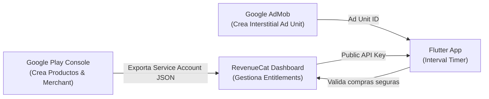

# Análisis Estratégico de Monetización Freemium y Publicidad (F06)

> **Proyecto:** Interval Timer (Flutter)  
> **Fecha de actualización:** 10 de Septiembre, 2026  
> **Estado:** Documento de Producto y Arquitectura de Monetización — Alineado 100% a las features y personalizaciones implementadas en el código fuente.  
> **Principios rectores:** Causa raíz, cero fricción durante el entrenamiento, alto valor percibido en Pro, arquitectura escalable y desacoplada (Clean Architecture + DDD).

---

## 1. Resumen Ejecutivo y Filosofía del Embudo

El objetivo es consolidar el modelo de negocio **Freemium híbrido** comercialmente viable y ético, basado en una premisa innegociable de la industria fitness:

> **"El loop de entrenamiento básico es sagrado y gratuito; se monetiza la escala, la conveniencia operativa y la personalización estética profunda."**

1. **Capa Gratuita (Free):** Ofrece un temporizador de intervalos impecable, sin interrupciones durante el esfuerzo, con acceso al catálogo completo de rutinas de fábrica y capacidad de crear hasta 3 rutinas propias.
2. **Monetización Pasiva (Ads):** Anuncios intersticiales de pantalla completa **únicamente al pulsar 'Listo' tras completar la sesión** (`SessionCompleteScreen`), asegurando cero interrupciones mientras el usuario entrena y monetizando al 90-95% de usuarios que nunca pagarán una suscripción.
3. **Capa Premium (Pro Tier):** Desbloqueo de rutinas propias ilimitadas, eliminación absoluta de publicidad, personalización estética avanzada (paleta de acento de la app, colores de fase con mockup interactivo, catálogo de clips SFX) y registro biométrico/histórico completo (peso sin límite y medidas corporales).

---

## 2. Contraste con el Mercado y Competidores Líderes

El benchmark de la industria para aplicaciones de temporizadores y tracking de entrenamiento demuestra patrones claros:

| Competidor | Modelo de Monetización | Restricciones en Capa Free | Gatillos Principales de Conversión a Pro |
|---|---|---|---|
| **Seconds Pro** *(Estándar de oro)* | Freemium / Pago único ($9.99) | Permite usar timers pero **no permite guardar más de un temporizador editado** (se reinicia al salir). | Capacidad de guardar múltiples rutinas, coordinar música y exportar. |
| **Tabata Timer** *(Eugene Sharafan)* | Freemium con Ads agresivos | Banners constantes y anuncios entre pantallas; configuraciones de audio y backup limitadas. | Eliminar publicidad, sonidos adicionales, personalización de paleta y exportación. |
| **Hevy / Strong** *(Tracking y Rutinas)* | Freemium por suscripción ($4.99/mo o $29.99/yr) | **Límite estricto de 3-4 rutinas creadas**; historial limitado a los últimos meses. | **Rutinas ilimitadas**, analíticas avanzadas, notas ilimitadas y personalizaciones de temas/iconos. |
| **Nike Training Club** | 100% Gratuito (Subvencionado) | Sin paywalls directos. | Modelo corporativo de branding y venta de calzado/indumentaria (no aplicable a software independiente). |

**Conclusión del mercado:** Cobrar por el motor del cronómetro o por el Modo Oscuro genera abandono y reseñas de 1 estrella. El punto óptimo de conversión comprobado por *Hevy* y *Seconds* es **fidelizar al usuario con 3 entrenamientos propios gratis** y cobrar cuando el atleta busca programar su semana completa de entrenamiento.

---

## 3. Matriz de Producto: Features Implementadas Actualmente

*Nota: Esta matriz contempla **únicamente** las funcionalidades que ya existen en el código fuente de la aplicación.*

| Módulo / Feature | Capa Free (Gratuita) | Capa Pro (Premium) | Estado en Código (Implementación) | Justificación Estratégica y de Mercado |
|---|:---:|:---:|:---:|---|
| **Motor de Temporizador Core (`timer`)** | ✅ **Ilimitado** | ✅ **Ilimitado** | 🟢 **Implementado (Free)** | El conteo, fases (preparación, trabajo, descanso, enfriamiento) y `CountdownRing` son núcleo gratuito. |
| **Catálogo de Rutinas Predefinidas (`preset_routines`)** | ✅ **Acceso Total** | ✅ **Acceso Total** | 🟢 **Implementado (Free)** | Todas las rutinas de catálogo (Tabata, HIIT, Boxeo, EMOM) y técnica en bottom sheet. |
| **Entrenamientos Propios Creados (`workout_builder`)** | ⚠️ **Máximo 3 rutinas** | 🚀 **Ilimitados** | 🟢 **Implementado en Código** | **Motor #1 de conversión:** Gate activo en código, bloquea creación a partir de la 4ª rutina si es Free. |
| **Color de Acento Global (`accentColor`)** | ⚠️ Solar Orange fijo | 🚀 **8 Variantes Curadas** | 🟢 **Implementado en Código** | Gate activo en Settings: tapping en variantes bloqueadas dispara `PaywallModalScreen`. |
| **Colores de Fase (`PhaseColorPickerScreen`)** | ⚠️ Colores estándar | 🚀 **Customizer + Mockup** | 🟢 **Implementado en Código** | Gate activo: guardar colores personalizados exige Pro y dispara Paywall si es Free. |
| **Audio SFX Clips Deportivos (`SoundService`)** | ⚠️ Beeps utilitarios | 🚀 **Catálogo Completo** | 🟢 **Implementado en Código** | Gate activo: clips de boxeo/silbato bloqueados con `ProBadge`, con preescucha auditiva libre. |
| **Music Ducking (`music_ducking`)** | ✅ **Atenuación activa** | ✅ **Atenuación activa** | 🟢 **Implementado (Free)** | Activo por defecto para todos los usuarios sin restricciones ni barreras de pago. |
| **Notas al Finalizar Sesión (`session_summary`)** | ✅ **100% Libre** | ✅ **100% Libre** | 🟢 **Implementado (Free)** | Campo de notas editable sin paywall en `SessionCompleteScreen` para proteger el feedback loop. |
| **Modo de Tema (Claro / Oscuro / Sistema)** | ✅ **Gratis** | ✅ **Gratis** | 🟢 **Implementado (Free)** | Estándar de accesibilidad del sistema operativo en 2026; nunca debe cobrarse. |
| **Internacionalización (Español / Inglés)** | ✅ **Gratis** | ✅ **Gratis** | 🟢 **Implementado (Free)** | Accesibilidad e inclusión básica para mercados hispanohablantes y angloparlantes. |
| **Wakelock (Pantalla encendida)** | ✅ **Gratis** | ✅ **Gratis** | 🟢 **Implementado (Free)** | Requisito fundamental para que el teléfono no se apague durante el entrenamiento. |
| **Favoritos (`favorites`)** | ✅ **Incluido** | ✅ **Incluido** | 🟢 **Implementado (Free)** | Facilidad de acceso para rutinas frecuentes. |
| **Sistema de Logros (`achievements`)** | ✅ **Incluido** | ✅ **Incluido** | 🟢 **Implementado (Free)** | Motor de gamificación para incentivar la retención diaria del usuario. |
| **Seguimiento Corporal y Peso (`body_tracking`)** | ⚠️ Peso actual + últimos 5 | 🚀 **Historial y medidas completas** | 🟢 **Implementado en Código** | Ventana deslizante de 5 pesajes visibles, `_LockedProHistoryCard` con `ProBadge` al detectar histórico oculto y compuerta anti-bypass en medidas corporales. |
| **Historial en Calendario (`calendar_history`)** | ✅ **100% Libre** | ✅ **100% Libre** | 🟢 **Implementado (Free)** | Navegación y registro histórico ilimitado de entrenamientos en el calendario sin restricciones temporales ni barreras de pago. |
| **Pantalla de Bloqueo / Background (`lock_screen` / F20)** | ✅ **100% Libre** | ✅ **100% Libre** | 🟢 **Implementado (Free)** | Notificación persistente con controles de pausa/salto y live session libres para garantizar ergonomía deportiva. |
| **Publicidad (Google AdMob)** | ⚠️ Intersticial al finalizar | 🚫 **100% libre de anuncios** | ⏳ **PENDIENTE EN CÓDIGO** | SDK de Google Mobile Ads y bloques intersticiales pendientes de integración externa. |
| **Compartir Sesión (`session_summary`)** | ⚠️ Con marca de agua | 🚀 **Tarjeta limpia Pro** | ⏳ **PENDIENTE EN CÓDIGO** | *Actualmente la tarjeta se comparte sin marca; la distinción visual de marca de agua aún no se ha codificado.* |

---

## 4. Política de Personalización y Configuración Estética (Visual & Audio)

Actualmente la aplicación cuenta con un sólido abanico de personalizaciones en su capa de presentación y servicios multimedia. A continuación se establece la delimitación estratégica entre lo que debe ser universalmente libre para garantizar accesibilidad y lo que constituye valor aspiracional de la suscripción Pro:

### 4.1 Desglose de Personalizaciones Implementadas

1. **Paleta de Color de Acento Global (`accentColor`):**
   - **Capa Free:** Color institucional predeterminado (**Solar Orange** `#FF6B00`).
   - **Capa Pro:** Desbloqueo de la paleta curada completa de 8 colores de acento (Cyber Neon, Electric Blue, Crimson Red, Mint Forest, Royal Purple, Rose Gold, Sunset Coral, Deep Slate).
   - *Benchmark:* Apps de productividad y fitness (*Overcast*, *Apollo*, *Hevy*) utilizan los colores de acento y personalización de temas como el principal motor de micro-conversión cosmética.

2. **Personalización de Colores de Fase (`PhaseColorPickerScreen`):**
   - **Capa Free:** Colores ergonómicos estándar garantizados por el Design System (Verde esmeralda para Trabajo, Ámbar cálido para Descanso).
   - **Capa Pro:** Selector interactivo de colores de fase con vista previa en tiempo real sobre el **Mockup de Smartphone** (`PhoneMockupPreview`).
   - *Benchmark:* Permite a practicantes de disciplinas específicas (como artes marciales o CrossFit) adaptar los contrastes a las condiciones lumínicas de su gimnasio o dojo.

3. **Catálogo de Efectos de Sonido / SFX Slots (`SfxSlot` / `SoundService`):**
   - **Capa Free:** Sonidos utilitarios esenciales (Beep digital clásico de 3-2-1 y feedback háptico con vibración).
   - **Capa Pro:** Catálogo ampliado de clips de audio deportivo de alta fidelidad:
     - **Gong de Boxeo clásico** (inicio y fin de round).
     - **Silbato de Árbitro / Entrenador** (típico de WODs de CrossFit).
     - **Campana de Gimnasio tradicional**.
     - **Sintetizadores electrónicos modernos**.
   - *Benchmark:* En *Seconds Pro* y *Tabata Timer*, los paquetes de sonidos de boxeo y campanas representan una de las razones explícitas por las que los usuarios pagan.

4. **Music Ducking con Spotify / Apple Music (`music_ducking`):**
   - **Capa Free:** ✅ **100% Libre y activa por defecto.** Atenúa suavemente la música de fondo durante anuncios de voz y alertas sonoras, restaurándola al instante.
   - **Capa Pro:** ✅ **Incluido por defecto.** Misma experiencia acústica fluida sin restricciones.
   - *Decisión de Producto:* Se clasifica como funcionalidad esencial de ergonomía sonora; no se cobra para asegurar entrenamientos de máxima inmersión desde el primer día.

5. **Notas de Entrenamiento Inmediatas (`session_summary`):**
   - **Capa Free:** ✅ **100% Libre.** El atleta puede redactar sus sensaciones, RPE o cargas inmediatamente tras finalizar el temporizador en la pantalla de resumen.
   - **Capa Pro:** ✅ **Incluido por defecto.** Misma experiencia acústica y de registro sin restricciones.
   - *Decisión de Producto:* Se clasifica como parte vital del core loop post-entrenamiento; no se bloquea para no frustrar al atleta justo al completar su esfuerzo.

### 4.2 Matriz Resumen de Personalización

| Funcionalidad de Personalización | Capa Free (Gratuita) | Capa Pro (Premium) | Estado en Código | Justificación de Mercado y UX |
|---|:---:|:---:|:---:|---|
| **Modo Oscuro / Claro / Sistema** | ✅ **100% Libre** | ✅ **100% Libre** | 🟢 **Implementado (Free)** | Estándar de accesibilidad de Android e iOS. Nunca debe cobrarse. |
| **Idioma (Español / Inglés)** | ✅ **100% Libre** | ✅ **100% Libre** | 🟢 **Implementado (Free)** | Inclusión y usabilidad básica sin barreras. |
| **Mantener Pantalla Encendida (Wakelock)** | ✅ **100% Libre** | ✅ **100% Libre** | 🟢 **Implementado (Free)** | Requisito fundamental para que la app sea funcional durante el ejercicio. |
| **Color de Acento Principal** | ⚠️ Solar Orange fijo | 🚀 **8 Variantes Curadas** | 🟢 **Implementado en Código** | Cosmética aspiracional; compuerta activa con `PaywallModalScreen`. |
| **Colores de Fase (Trabajo/Descanso)** | ⚠️ Colores estándar | 🚀 **Customizer + Mockup** | 🟢 **Implementado en Código** | Hiper-personalización visual; selector y guardado bloqueados detrás de Pro. |
| **Audio: Beeps Básicos + Háptica** | ✅ **100% Libre** | ✅ **100% Libre** | 🟢 **Implementado (Free)** | Feedback esencial para entrenar sin mirar la pantalla. |
| **Audio: Clips Deportivos (Gong, Silbato, Campana)** | ❌ No disponible | 🚀 **Catálogo Completo** | 🟢 **Implementado en Código** | Bloqueo activo con `ProBadge` y paywall; preescucha auditiva libre. |
| **Music Ducking (Spotify/Apple Music)** | ✅ **100% Libre** | ✅ **100% Libre** | 🟢 **Implementado (Free)** | Confort auditivo universal durante entrenamientos con música (activo por defecto). |
| **Notas al Completar Sesión** | ✅ **100% Libre** | ✅ **100% Libre** | 🟢 **Implementado (Free)** | Pieza clave del core loop de entrenamiento; sin barreras de paywall. |

---

## 5. Estrategia de Monetización con Anuncios (Google AdMob)

### 5.1 Formatos analizados y estimación de ingresos (eCPM)

| Formato de Anuncio | Ubicación en la App | eCPM Estimado (LATAM) | eCPM Estimado (USA/EU) | Veredicto de Arquitectura |
|---|---|:---:|:---:|---|
| **Banner estándar (320x50)** | Pie de pantalla en Rutinas/Historial | $0.20 – $0.60 USD | $1.50 – $3.00 USD | **Desaconsejado:** Rinde muy poco dinero y ensucia la estética pulida de la app. |
| **Intersticial (Pantalla completa)** | Al pulsar "Listo" en `SessionCompletedScreen` | **$4.00 – $10.00 USD** | **$15.00 – $28.00 USD** | **RECOMENDADO:** Monetización alta, cero impacto en el entrenamiento. |
| **Rewarded Video (Bonificado)** | "Mirá un video para crear 1 rutina extra temporal" | $8.00 – $18.00 USD | $25.00 – $45.00 USD | **Opcional a futuro:** Para usuarios que rehúsan pagar pero quieren una rutina más. |

### 5.2 La Regla de Oro UX de la Publicidad
> **PROHIBICIÓN ESTRICTA:** Queda terminantemente prohibido mostrar banners o anuncios emergentes mientras una sesión de temporizador esté activa o pausada.
- Un anuncio durante el ejercicio provoca toques accidentales, fatiga visual, caídas de retención y reseñas de 1 estrella en Google Play.
- El único momento psicológicamente apto es **tras la satisfacción de haber completado la rutina**, justo antes de regresar a la pantalla principal.

---

## 6. Estrategia de Precios y Tiers de Suscripción

Analizando a los competidores líderes (*Seconds Pro*, *Tabata Timer*, *Hevy*):

1. **Suscripción Mensual:**
   - **Precio sugerido:** `$2.99 USD / mes` (o equivalente en moneda local ajustado por Google Play).
   - **Rol:** Para usuarios indecisos o que quieren probar 1 o 2 meses sin ataduras.
2. **Suscripción Anual (La opción principal):**
   - **Precio sugerido:** `$17.99 USD / año` (equivale a `$1.50 USD / mes` → **50% de descuento** destacado).
   - **Prueba gratuita (Free Trial):** 7 días gratis.
   - **Rol:** Concentra habitualmente entre el 65% y el 80% de los ingresos totales de una app móvil.
3. **Opción "Lifetime" (Pago único de por vida):**
   - **Precio sugerido:** `$29.99 USD` (pago único).
   - **Rol:** Captura a los usuarios que odian las suscripciones recurrentes y genera inyección de caja inmediata al lanzar.

---

## 7. Análisis de Viabilidad y Arquitectura Técnica en Nuestro Código

### 7.1 Auditoría de Compatibilidad en la Base de Código Actual

Hemos analizado minuciosamente las especificaciones del proyecto y las dependencias en `pubspec.yaml`, `android/app/build.gradle.kts` y `AndroidManifest.xml`:

| Componente Técnico | Estado en Nuestro Proyecto | Compatibilidad con AdMob & RevenueCat | Observaciones y Acciones Requeridas |
|---|---|:---:|---|
| **Flutter / Dart SDK** | Flutter 3.29+ / Dart SDK `^3.12.2` | ✅ **100% Compatible** | Ambos paquetes (`google_mobile_ads: ^5.2.0`, `purchases_flutter: ^8.7.0`) soportan Dart 3 y las últimas versiones de Flutter. |
| **Android minSdk** | `flutter.minSdkVersion` (API 21 / Android 5.0) | ✅ **100% Compatible** | Ambos SDKs exigen `minSdk >= 21`. Nuestra configuración cubre el 99.5% de dispositivos Android activos sin tocar nada. |
| **Java / Gradle / Desugaring** | Java 17 + `isCoreLibraryDesugaringEnabled = true` | ✅ **100% Compatible** | Ya tenemos `desugar_jdk_libs: 2.1.4` configurado en `build.gradle.kts` para `flutter_local_notifications`. Esto previene fallos de runtime. |
| **Arquitectura de Base de Datos y Estado** | Drift (SQLite) + Riverpod (`flutter_riverpod: ^2.6.1`) | ✅ **100% Compatible** | El estado de suscripción (`isPro`) se modela de forma reactiva en Riverpod y no colisiona con el almacenamiento local de rutinas. |
| **Servicios en Segundo Plano y Audio** | `flutter_background_service`, `audio_session`, `audioplayers` | ✅ **100% Compatible** | La regla de oro de AdMob (no mostrar anuncios con timer corriendo) garantiza que el audio y el ciclo de vida del temporizador nunca sean interrumpidos. |

### 7.2 Ajustes Obligatorios en el Proyecto antes de Producción

1. **Cambio de Application ID / Package Name (CRÍTICO):**
   - Actualmente configurado como: `com.example.interval_timer` en `android/app/build.gradle.kts`.
   - **Google Play Console rechaza tajantemente cualquier APK o Bundle que contenga `com.example.*`.**
   - Antes de subir la app, se debe renombrar a un ID único y formal (ejemplo: `com.moisescorcho.intervaltimer`).
2. **Permisos en `AndroidManifest.xml`:**
   - Agregar de forma explícita: `<uses-permission android:name="android.permission.INTERNET"/>` (indispensable para que AdMob cargue anuncios y RevenueCat valide compras en builds de release).
   - Nota: El permiso `<uses-permission android:name="com.android.vending.BILLING"/>` lo inyecta automáticamente el paquete `purchases_flutter` durante el merge de manifests.
3. **Metadatos de Google AdMob en `AndroidManifest.xml`:**
   - AdMob requiere obligatoriamente registrar el `APPLICATION_ID` dentro de la etiqueta `<application>`:
     ```xml
     <meta-data
         android:name="com.google.android.gms.ads.APPLICATION_ID"
         android:value="ca-app-pub-3940256099942544~3347511713"/> <!-- ID oficial de prueba -->
     ```
   - *Nota de seguridad:* Si este metadato falta al inicializar `MobileAds.instance.initialize()`, la app experimenta un crash inmediato al abrirse.

### 7.3 ¿Por qué RevenueCat y NO backend propio?

Montar un backend propio (servidor Node/Python, base de datos de usuarios, escuchar webhooks RTDN de Google Play y App Store Server Notifications, validar firmas criptográficas) requiere semanas de desarrollo y costos fijos de servidor.

**RevenueCat (`purchases_flutter`):**
- **Costo:** **Completamente gratuito** hasta los primeros $2,500 USD de facturación mensual.
- **Ventajas:**
  - SDK nativo de Flutter mantenido activamente.
  - Validación de recibos anti-fraude directamente con los servidores de Google y Apple.
  - Gestión automática de cancelaciones, períodos de gracia, reembolsos y renovaciones.
  - Métricas analíticas en tiempo real (MRR, Churn, ARR, conversiones de prueba a pago).
  - Desacoplamiento total: la app no necesita saber cómo funciona la API interna de Google Play Billing.

### 7.4 Estructura en Clean Architecture (Riverpod)

Para respetar el principio de **cero parches y desacoplamiento estricto**, el módulo de monetización se estructura bajo `lib/features/subscription/`:

```
lib/features/subscription/
├── application/
│   ├── subscription_providers.dart    # isProProvider (Provider<bool>), offeringsProvider
│   └── subscription_controller.dart   # AsyncNotifier para compra, restauración y chequeo
├── domain/
│   ├── subscription_tier.dart         # Enum: free, pro
│   ├── subscription_offering.dart     # Entidad de dominio con planes (mensual, anual, lifetime)
│   └── purchase_service.dart          # Contrato abstracto (interfaz pura de dominio)
├── infrastructure/
│   ├── revenue_cat_purchase_service.dart  # Implementación concreta con purchases_flutter
│   └── fake_purchase_service.dart         # Implementación fake para pruebas unitarias y desarrollo local
└── presentation/
    ├── paywall_screen.dart            # Pantalla de beneficios y compra (Paywall modal)
    ├── widgets/
    │   ├── pro_gate.dart              # Guard Widget: envuelve widgets o intercepta acciones
    │   └── pro_badge.dart             # Chip visual elegante "PRO"
    └── ad_interstitial_manager.dart   # Controlador de AdMob (solo carga anuncios si !isPro)
```

### 7.5 Lógica del Guard Reactivo (`ProGate`)

En lugar de llenar el código de condicionales dispersos, usamos un guard limpio:

```dart
// Ejemplo conceptual en la capa de presentación:
void onAddNewWorkoutPressed(BuildContext context, WidgetRef ref) {
  final isPro = ref.read(isProProvider);
  final userWorkoutsCount = ref.read(customWorkoutsCountProvider);

  if (!isPro && userWorkoutsCount >= 3) {
    showAppModalBottomSheet(
      context: context,
      builder: (_) => const PaywallSheet(reason: PaywallTrigger.routineLimit),
    );
    return;
  }

  // Si es Pro o tiene menos de 3, procede a crear la rutina
  context.push(AppRoutes.workoutBuilder);
}
```

---

## 8. Guía Maestra de Configuración Externa Paso a Paso (Para Principiantes)

Si nunca antes trabajaste con Google Play Console, AdMob o RevenueCat, esta sección detalla exactamente qué debés hacer en cada plataforma, sin dar nada por sentado:



---

### Paso 1: Google Play Console (La tienda oficial y recepción de pagos)

1. **Registro de Desarrollador ($25 USD pago único de por vida):**
   - Entrar a [Google Play Console](https://play.google.com/console/signup).
   - Iniciar sesión con tu cuenta de Google.
   - Pagar la cuota de registro de $25 USD con tarjeta de crédito/débito internacional.
   - **Verificación de Identidad:** Google te solicitará subir una foto nítida de tu documento de identidad (DNI o Pasaporte) y verificar tu número de teléfono. La aprobación suele demorar entre 24 y 48 horas hábiles.
2. **Configuración del Perfil de Pagos (Merchant Account):**
   - En el menú lateral de Play Console, ir a **Configuración > Pagos y suscripciones > Perfil de pagos** (o Configuración financiera).
   - Ingresar los datos fiscales (nombre legal, país de residencia, dirección).
   - Vincular tu **cuenta bancaria** donde querés recibir las transferencias mensuales de dinero (Google deposita automáticamente los días 15 de cada mes las ganancias acumuladas tras retener su comisión del 15%).
3. **Creación de la Aplicación en Play Console:**
   - Hacer clic en el botón azul **"Crear aplicación"**.
   - Nombre de la app: `Interval Timer`.
   - Idioma predeterminado: Español o Inglés.
   - Tipo de app: Seleccionar **"Aplicación"** y en precio seleccionar **"Gratis"** (importante: las apps que usan compras in-app o suscripciones se registran como gratis).
4. **Subir el primer archivo compilado (.aab) a Pruebas Internas (REQUISITO CRÍTICO):**
   - *Regla obligatoria de Google:* **No se pueden crear suscripciones ni productos integrados hasta que no subas al menos una primera versión de la app firmada** que contenga el permiso de facturación (`BILLING`).
   - En Flutter se compila con: `flutter build appbundle --release`.
   - En Play Console, ir a **Pruebas > Pruebas internas (Internal Testing)** y subir el archivo `.aab` generado. (No es necesario que la app esté 100% terminada, solo que compile y tenga el package name definitivo).
5. **Dar de alta las Suscripciones y el Producto Lifetime:**
   - **Suscripciones (`Monetizar > Suscripciones`):**
     - Clic en **"Crear suscripción"**.
     - ID de suscripción: `pro_subscription`.
     - Nombre: `Acceso Interval Timer Pro`.
     - Crear **Plan Base Mensual:** ID `monthly-plan`, tipo autorenovable, precio `$2.99 USD` (Google calcula automáticamente los precios locales para cada país).
     - Crear **Plan Base Anual:** ID `yearly-plan`, tipo autorenovable, precio `$17.99 USD`.
     - Agregar **Fase de Prueba Gratuita (Free Trial):** En el plan anual, hacer clic en *"Agregar fase"* > *"Prueba gratuita"* > Duración: `7 días`.
   - **Producto de Pago Único (`Monetizar > Productos integrados en la aplicación`):**
     - Clic en **"Crear producto"**.
     - ID de producto: `pro_lifetime`.
     - Nombre: `Acceso Pro de por Vida`.
     - Precio: `$29.99 USD` (pago único, producto no consumible).

---

### Paso 2: Google AdMob (Plataforma de Anuncios)

1. **Creación de Cuenta en AdMob:**
   - Entrar a [Google AdMob](https://admob.google.com/) e iniciar sesión con la misma cuenta de Google.
   - Completar los datos de facturación e información fiscal para cobros de anuncios.
2. **Crear la App en AdMob:**
   - En el menú lateral, ir a **Apps > Agregar app**.
   - Plataforma: **Android**.
   - "¿La app está en una tienda admitida?": Marcar *"Sí"* (si ya está en Play Console) o *"Aún no"* (si estás en desarrollo).
   - Nombre: `Interval Timer Android`.
   - Al finalizar, AdMob te entrega tu **AdMob App ID** (tiene este formato: `ca-app-pub-XXXXXXXXXXXXXXXX~YYYYYYYYYY`).
3. **Crear el Bloque de Anuncio Intersticial:**
   - Dentro de tu app en AdMob, ir a **Bloques de anuncios > Agregar bloque de anuncios**.
   - Seleccionar el formato **Intersticial (Pantalla completa)**.
   - Nombre del bloque: `interstitial_session_complete`.
   - AdMob te generará tu **Ad Unit ID** (tiene este formato: `ca-app-pub-XXXXXXXXXXXXXXXX/ZZZZZZZZZZ`). Este ID es el que se usa en el código de producción.

---

### Paso 3: RevenueCat (Vínculo inteligente entre Flutter y Google Play)

1. **Crear Cuenta Gratuita:**
   - Registrarse en [RevenueCat.com](https://www.revenuecat.com/).
   - Crear un nuevo proyecto llamado `Interval Timer`.
2. **Conectar Google Play Console con RevenueCat (Paso de Service Account):**
   - Para que RevenueCat pueda validar compras automáticamente, necesita permisos de lectura en Google Play. Esto se hace mediante una **Cuenta de Servicio de Google Cloud**:
     - Entrar a Google Cloud Console vinculado a tu cuenta de Play Console.
     - Ir a **IAM y administración > Cuentas de servicio > Crear cuenta de servicio**.
     - Asignar nombre: `revenuecat-billing-sync`.
     - Crear una **clave privada en formato JSON** (`Descargar JSON`).
     - En Google Play Console, ir a **Usuarios y permisos > Invitar nuevo usuario**, pegar el correo de la cuenta de servicio y asignarle permisos de *"Ver datos financieros"* y *"Gestionar pedidos e importes"*.
     - En el panel de RevenueCat, ir a **Project Settings > Integrations > Google Play**, subir el archivo JSON descargado y colocar el Package Name de tu app.
3. **Configuración de Entitlements, Products y Offerings en RevenueCat:**
   - **Entitlement (El permiso digital):** Crear un entitlement llamado `pro_access`. (Este es el identificador único que en Flutter desbloquea las características Pro).
   - **Products:** Cargar los IDs que creamos en Google Play (`monthly-plan`, `yearly-plan`, `pro_lifetime`) y asociarlos al entitlement `pro_access`.
   - **Offerings (La oferta que ve el usuario):**
     - Crear una oferta llamada `default`.
     - Crear los 3 paquetes estándar:
       - `$rc_monthly` -> vinculado a `monthly-plan`.
       - `$rc_annual` -> vinculado a `yearly-plan`.
       - `$rc_lifetime` -> vinculado a `pro_lifetime`.
4. **Obtener la Public API Key de Flutter:**
   - En RevenueCat, ir a **Project Settings > API Keys**.
   - Copiar la clave pública para Android (empieza con `goog_...`). Esta clave es segura y es la que se inicializa en Flutter mediante `Purchases.configure(PurchasesConfiguration("goog_..."))`.

---

## 9. Protocolo de Verificación y Testing en Desarrollo (Cómo Probar Todo sin Gastar Dinero)

Es fundamental validar el 100% de los flujos en desarrollo antes de publicar la app:

### 9.1 Simulación de Compras con Google Play License Testers (Cero Costo Real)

Google Play Console incluye un entorno de pruebas de licencia donde **las compras son 100% ficticias y no cobran dinero**:

1. En Google Play Console, ir a **Configuración > Configuración de la cuenta > Pruebas de licencia**.
2. En el campo *"Direcciones de correo de los evaluadores con licencia"*, agregar tu correo de Gmail (el mismo con el que tenés configurado tu teléfono físico de pruebas o emulador).
3. En *"Respuesta de prueba de licencia"*, seleccionar `RESPOND_NORMALLY`.
4. **Cómo se ve al probar:**
   - Al abrir el paywall en la app y pulsar "Suscribirme", la pasarela de Google Play se abre mostrando una tarjeta especial llamada:
     > *"Tarjeta de prueba (Siempre aprueba) - Test Card"*
   - Tocás "Comprar", la transacción se procesa instantáneamente por **$0.00 USD** y RevenueCat recibe el evento desbloqueando Pro en tu app.
5. **Tiempos acelerados de suscripción para pruebas:**
   - En este modo de prueba, Google acelera los tiempos para que no tengas que esperar un año a ver qué pasa:
     - Una suscripción de **1 mes dura 5 minutos**.
     - Una suscripción de **1 año dura 30 minutos**.
     - Un período de prueba de **7 días dura 3 minutos**.
   - Esto te permite probar en una sola tarde qué pasa cuando el usuario cancela, renueva o se le vence la suscripción.

### 9.2 Simulación Instantánea en RevenueCat Dashboard (Sandbox Grants)

Si estás probando y querés desbloquear Pro de inmediato sin pasar por Google:
1. En el panel de RevenueCat, buscar a tu usuario en la sección **Customers**.
2. Hacer clic en el botón **"Grant Promotional Entitlement"**.
3. Seleccionar `pro_access` y una duración (por ejemplo, 30 días).
4. La app en Flutter recibe el evento en tiempo real y pasa a estado Pro automáticamente.

### 9.3 Verificación de Anuncios AdMob en Desarrollo (Cero Riesgo de Baneo)

Nunca se deben usar los IDs reales de AdMob en depuración porque Google suspende cuentas por clics o impresiones automáticas. Para probar:

1. **Uso de IDs de Prueba Oficiales de Google:**
   - En modo debug usamos los identificadores universales de Google:
     - **App ID de prueba:** `ca-app-pub-3940256099942544~3347511713`
     - **Intersticial Ad Unit ID de prueba:** `ca-app-pub-3940256099942544/1033173712`
2. **Dispositivos de Prueba Registrados (`Test Devices`):**
   - Si corrés la app en tu celular físico, en la consola de Flutter (`flutter logs`) AdMob imprime una línea con tu ID de dispositivo:
     `RequestConfiguration.Builder().setTestDeviceIds(listOf("E492B456C8..."))`
   - Configurando ese ID, AdMob muestra anuncios reales con la leyenda explícita **"Test Ad"** garantizando que nunca te sancionen.
3. **Validación del Momento de Muestra:**
   - Verificar que al terminar una rutina de intervalos y pulsar "Listo" en `SessionCompleteScreen`, el anuncio intersticial se precargue y muestre limpiamente sin saltos visuales ni congelamiento de pantalla.

### 9.4 Modo Aislamiento Local en Clean Architecture (`FakePurchaseService`)

Para el desarrollo diario del equipo y la suite de pruebas unitarias (`flutter test`):
- Se implementa `FakePurchaseService implements PurchaseService`.
- En la pantalla de `SettingsScreen`, cuando `kDebugMode == true`, se muestra un switch oculto de desarrollador:
  > `[Debug] Modo Pro Activo: [ON / OFF]`
- Al cambiar este switch, Riverpod actualiza `isProProvider` instantáneamente:
  - Validamos en segundos si el límite de 3 rutinas se activa o desactiva.
  - Validamos si los 8 colores de acento se bloquean con candado o se pueden elegir.
  - Validamos si los clips de sonido (gong, silbato) se reproducen o solicitan Pro.
  - Validamos si los anuncios de AdMob se suprimen de raíz.
- **Ventaja:** Todo el equipo puede probar los límites sin depender de conexión a internet ni de consolas externas.

---

## 10. Próximos Pasos Sugeridos

1. **Aprobación de la Estrategia:** Validar que los límites definidos (3 rutinas gratis, 8 colores y clips en Pro, precios de $2.99 / $17.99 / $29.99) sean de tu total agrado.
2. **Consolidación de la Rama Actual:** La rama `fix/ui-ux-refinements` ya tiene sus 429 tests en verde, el fix de scroll en bottom sheets verificado y la documentación actualizada. Corresponde subirla y mergearla a `develop`.
3. **Inicio de F06 en SDD:** Redactar los requerimientos y diseño formal de `specs/features/06-pro-tier-iap/` implementando el `PurchaseService`, los `ProGate` y el `FakePurchaseService` con TDD riguroso.
