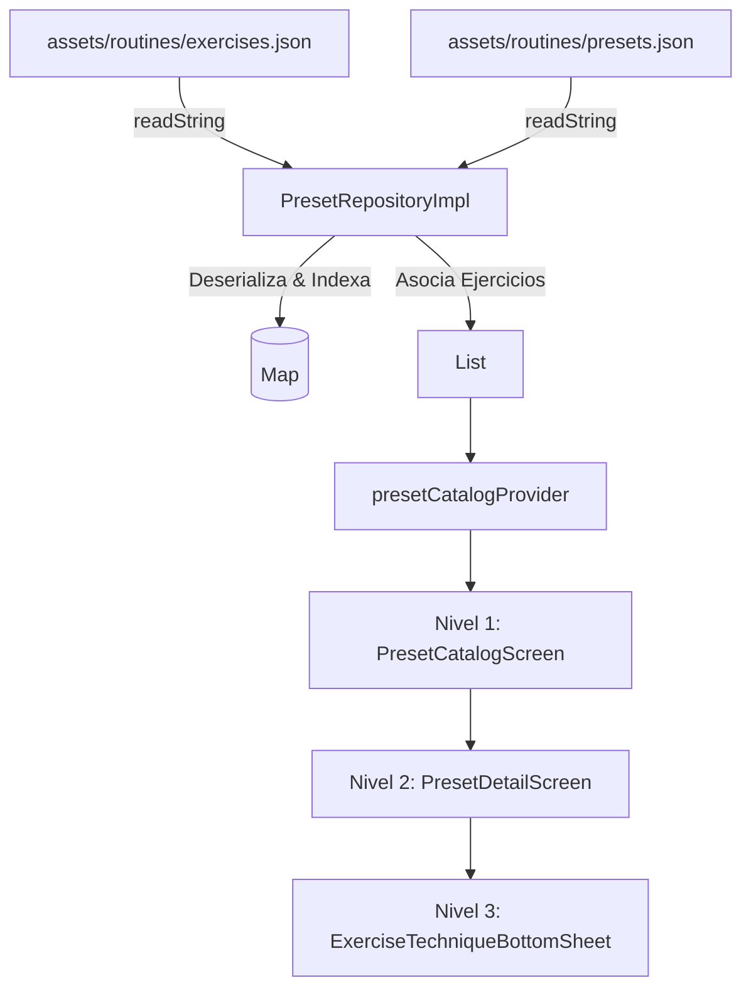
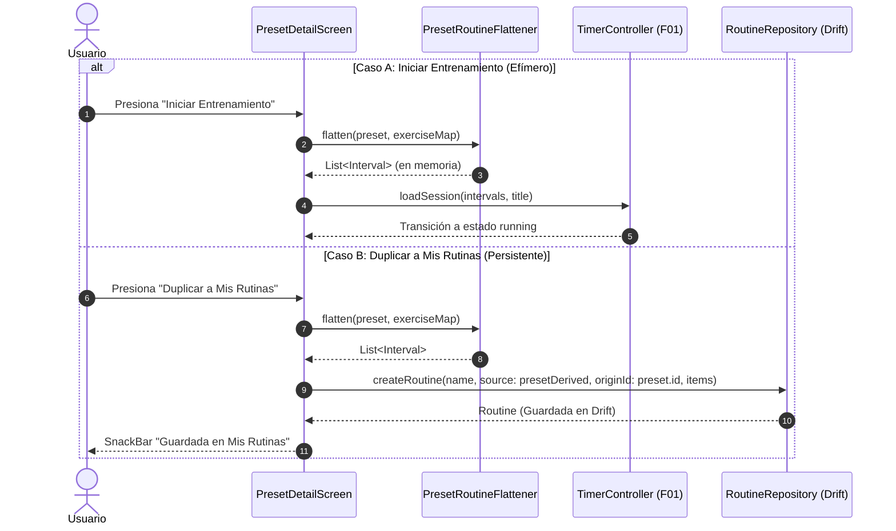

# Design: Sesiones Preestablecidas con Animación/Video

**ID:** F03 &nbsp;|&nbsp; **Slug:** `03-preset-workout-sessions`

## Contexto

Este documento describe la arquitectura y el diseño técnico para implementar el catálogo de rutinas preestablecidas de la feature `03-preset-workout-sessions`.
El diseño garantiza una experiencia fluida e inmersiva en 3 niveles de UI, funcionamiento 100% offline, desacoplamiento completo entre el catálogo de ejercicios maestro y la estructura de rutinas, inicio efímero en el motor de temporizador (F01) y resiliencia ante assets faltantes.

## Referencias

- `_global/01-vision-and-principles.md` — Garantía de funcionamiento 100% offline-first sin dependencias de backend.
- `_global/02-architecture-and-structure.md` — Separación de capas (`domain`, `data`, `application`, `presentation`).
- `_global/03-conventions.md` — Manejo de estado con Riverpod y patrones de testing.
- `_global/04-design-system.md` — Guía visual, jerarquía visual, botones flotantes, tarjetas y bottom sheets.
- `_global/05-data-model.md` — Especificación de `PresetRoutine`, `Exercise`, `Interval` y `RoutineSource`.

---

## Decisiones de Diseño

### 1. Estrategia de 2 JSONs Independientes

Para evitar redundancia de datos y facilitar la reutilización de ejercicios entre múltiples rutinas, el contenido preestablecido se almacena en dos archivos JSON separados bajo `assets/routines/`:

1. **`exercises.json` (Catálogo Maestro de Ejercicios):** Contiene la información técnica detallada de cada ejercicio (id, nombre, categoría, tipo de media, asset path, pasos de ejecución 1-2-3 y consejos/tips).
2. **`presets.json` (Rutinas Preestablecidas):** Define las rutinas (id, título, descripción, categoría, dificultad, tiempo de descanso entre ejercicios) y contiene una lista ordenada de referencias a ejercicios con sus parámetros específicos (series/sets, segundos de trabajo y segundos de descanso intra-set).

Al cargar el repositorio, `PresetRepository` realiza un join en memoria entre `presets.json` y `exercises.json` utilizando `exerciseId`.

### 2. UI de 3 Niveles

La experiencia de usuario se divide estrictamente en 3 capas de navegación y detalle:

- **Nivel 1: `PresetCatalogScreen` (Exploración):**
  - **Carrusel superior:** Muestra las rutinas destacadas ("Popular" / "Recomendado").
  - **Grid de categorías:** Permite filtrar las rutinas por `PresetCategory` (HIIT, Core, Lower Body, Upper Body, Full Body, Cardio).
  - **Lista de tarjetas de rutinas:** Muestra chip de dificultad, duración total calculada, cantidad de ejercicios y miniatura.
- **Nivel 2: `PresetDetailScreen` (Detalle de Rutina):**
  - **Resumen ejecutivo:** Encabezado con imagen/badge de categoría, título, descripción, badge de dificultad y métricas (duración total, ejercicios, descanso).
  - **Lista de ejercicios:** Tarjetas ordenadas con número de paso, miniatura del ejercicio, sets × trabajo/descanso y botón de vista rápida de técnica.
  - **Botón Flotante (FAB):** Accionable prominente "Iniciar Entrenamiento".
  - **Menú/Acción Secundaria:** "Duplicar a Mis Rutinas" para copiar a Drift.
- **Nivel 3: `ExerciseTechniqueBottomSheet` (Modal de Técnica):**
  - Modal deslizable desde abajo que se invoca al tocar cualquier ejercicio.
  - Muestra la demostración visual (GIF/Lottie/Imagen), título, categoría muscular, ejecución paso a paso (1, 2, 3) y sección de consejos de postura ("Tips").

### 3. Mapeo Efímero a `TimerController` (F01) vía `PresetRoutineFlattener`

Para iniciar un entrenamiento preestablecido de manera instantánea y limpia:
- **No se escribe en la base de datos Drift** al presionar "Iniciar Entrenamiento".
- El servicio `PresetRoutineFlattener` toma el `PresetRoutine` cargado y genera una lista ordenada de objetos `Interval` en memoria.
- Los tipos de intervalo mapeados son: `warmup` (si la rutina incluye preparación), `work` (ejercicios), `rest` (descansos intra-set e inter-ejercicio) y `stretch`/`cooldown` (si aplica).
- Esta lista efímera de `Interval`s se pasa directamente al `TimerController` (F01) para comenzar la ejecución sin ensuciar la base de datos del usuario.

### 4. Presets Inmutables y Clonación a Drift ("Duplicar a Mis Rutinas")

- Los presets cargados desde assets son estrictamente de solo lectura (Read-Only).
- Si el usuario desea modificar o personalizar una rutina preestablecida, utiliza la acción **"Duplicar a Mis Rutinas"**.
- El caso de uso llama a `RoutineRepository` (F01/F05) para persistir una nueva rutina en Drift con:
  - `name`: `"${preset.title} (Copia)"`
  - `source`: `RoutineSource.presetDerived`
  - `originId`: `preset.id`
  - `items`: Lista de `IntervalRoutineItem` generados por el aplanador.

### 5. Enums Fuertemente Tipados y Mappers Seguros

En lugar de usar cadenas arbitrarias en la capa de presentación o dominio:
- `PresetCategory`: `hiit`, `core`, `lowerBody`, `upperBody`, `fullBody`, `cardio`.
- `DifficultyLevel`: `beginner`, `intermediate`, `advanced`.
- `MediaType`: `lottie`, `gif`, `video`, `image`.

Cada enum incluye un mapper `fromId(String id)` que retorna un valor seguro por defecto (fallback) en caso de encontrar cadenas desconocidas o malformadas en los JSONs.

### 6. Estrategia Resiliente de Media en 3 Niveles

Para garantizar que la aplicación nunca colapse (crash) por assets no encontrados:

```
[Intento de Renderizado de Media de Ejercicio]
                      |
                      v
      ¿Existe asset específico del ejercicio?
      (ej. assets/media/exercises/ex_pushup.png)
             /                 \
          SÍ                    NO
         /                        \
 [Mostrar Imagen/GIF/Lottie]   ¿Existe asset por categoría?
                               (ej. assets/media/categories/cat_upper.png)
                                      /                 \
                                   SÍ                    NO
                                  /                        \
                          [Mostrar Placeholder]    [Icono vectorial por defecto]
                                                   (Icons.fitness_center)
```

---

## Contratos de Datos y Esquemas JSON

### Esquema: `assets/routines/exercises.json`

```json
{
  "$schema": "http://json-schema.org/draft-07/schema#",
  "type": "array",
  "items": {
    "type": "object",
    "required": ["id", "name", "category", "mediaType", "mediaPath", "steps", "tips"],
    "properties": {
      "id": { "type": "string" },
      "name": { "type": "string" },
      "category": { "type": "string" },
      "mediaType": { "type": "string", "enum": ["lottie", "gif", "video", "image"] },
      "mediaPath": { "type": "string" },
      "steps": {
        "type": "array",
        "items": { "type": "string" }
      },
      "tips": {
        "type": "array",
        "items": { "type": "string" }
      }
    }
  }
}
```

### Muestra de Datos: Catálogo Inicial de 6 Presets (`assets/routines/presets.json`)

El catálogo incluye 6 rutinas variadas para cubrir distintas necesidades y niveles de condición física:

1. **`preset_hiit_15m`**: HIIT Quema Calórica 15m (Categoría: `hiit`, Dificultad: `intermediate`)
2. **`preset_abs_10m`**: Abs de Acero 10m (Categoría: `core`, Dificultad: `beginner`)
3. **`preset_legs_15m`**: Piernas & Glúteos 15m (Categoría: `lowerBody`, Dificultad: `intermediate`)
4. **`preset_fullbody_12m`**: Full Body Express 12m (Categoría: `fullBody`, Dificultad: `beginner`)
5. **`preset_upper_15m`**: Upper Body Pump 15m (Categoría: `upperBody`, Dificultad: `advanced`)
6. **`preset_cardio_8m`**: Cardio Tabata 8m (Categoría: `cardio`, Dificultad: `advanced`)

```json
[
  {
    "id": "preset_hiit_15m",
    "title": "HIIT Quema Calórica 15m",
    "description": "Sesión de alta intensidad para maximizar el gasto calórico y acelerar el metabolismo.",
    "category": "hiit",
    "difficulty": "intermediate",
    "isFeatured": true,
    "restBetweenExercisesSeconds": 15,
    "exercises": [
      { "exerciseId": "ex_jumping_jacks", "sets": 3, "workSeconds": 30, "restSeconds": 10 },
      { "exerciseId": "ex_burpees", "sets": 3, "workSeconds": 30, "restSeconds": 15 },
      { "exerciseId": "ex_mountain_climbers", "sets": 3, "workSeconds": 30, "restSeconds": 10 },
      { "exerciseId": "ex_high_knees", "sets": 3, "workSeconds": 30, "restSeconds": 10 }
    ]
  },
  {
    "id": "preset_abs_10m",
    "title": "Abs de Acero 10m",
    "description": "Rutina enfocada en el fortalecimiento del abdomen superior, inferior y oblicuos.",
    "category": "core",
    "difficulty": "beginner",
    "isFeatured": true,
    "restBetweenExercisesSeconds": 10,
    "exercises": [
      { "exerciseId": "ex_crunches", "sets": 3, "workSeconds": 40, "restSeconds": 15 },
      { "exerciseId": "ex_plank", "sets": 3, "workSeconds": 45, "restSeconds": 15 },
      { "exerciseId": "ex_bicycle_crunches", "sets": 3, "workSeconds": 30, "restSeconds": 10 }
    ]
  },
  {
    "id": "preset_legs_15m",
    "title": "Piernas & Glúteos 15m",
    "description": "Trabajo metabólico y de fuerza para miembros inferiores.",
    "category": "lowerBody",
    "difficulty": "intermediate",
    "isFeatured": false,
    "restBetweenExercisesSeconds": 20,
    "exercises": [
      { "exerciseId": "ex_squats", "sets": 4, "workSeconds": 40, "restSeconds": 15 },
      { "exerciseId": "ex_lunges", "sets": 3, "workSeconds": 35, "restSeconds": 15 },
      { "exerciseId": "ex_glute_bridges", "sets": 3, "workSeconds": 45, "restSeconds": 15 }
    ]
  },
  {
    "id": "preset_fullbody_12m",
    "title": "Full Body Express 12m",
    "description": "Activación corporal completa en poco tiempo, ideal para días ajetreados.",
    "category": "fullBody",
    "difficulty": "beginner",
    "isFeatured": true,
    "restBetweenExercisesSeconds": 15,
    "exercises": [
      { "exerciseId": "ex_jumping_jacks", "sets": 2, "workSeconds": 30, "restSeconds": 10 },
      { "exerciseId": "ex_pushups", "sets": 3, "workSeconds": 30, "restSeconds": 15 },
      { "exerciseId": "ex_squats", "sets": 3, "workSeconds": 40, "restSeconds": 15 }
    ]
  },
  {
    "id": "preset_upper_15m",
    "title": "Upper Body Pump 15m",
    "description": "Enfoque en pecho, espalda, hombros y brazos usando peso corporal.",
    "category": "upperBody",
    "difficulty": "advanced",
    "isFeatured": false,
    "restBetweenExercisesSeconds": 20,
    "exercises": [
      { "exerciseId": "ex_pushups", "sets": 4, "workSeconds": 40, "restSeconds": 15 },
      { "exerciseId": "ex_pike_pushups", "sets": 3, "workSeconds": 30, "restSeconds": 15 },
      { "exerciseId": "ex_tricep_dips", "sets": 3, "workSeconds": 35, "restSeconds": 15 }
    ]
  },
  {
    "id": "preset_cardio_8m",
    "title": "Cardio Tabata 8m",
    "description": "Protocolo Tabata clásico de 20s trabajo por 10s descanso a máxima intensidad.",
    "category": "cardio",
    "difficulty": "advanced",
    "isFeatured": false,
    "restBetweenExercisesSeconds": 10,
    "exercises": [
      { "exerciseId": "ex_burpees", "sets": 4, "workSeconds": 20, "restSeconds": 10 },
      { "exerciseId": "ex_mountain_climbers", "sets": 4, "workSeconds": 20, "restSeconds": 10 }
    ]
  }
]
```

---

## Modelos de Dominio Dart

```dart
enum PresetCategory {
  hiit('hiit', 'HIIT'),
  core('core', 'Abdomen & Core'),
  lowerBody('lowerBody', 'Piernas & Glúteos'),
  upperBody('upperBody', 'Tren Superior'),
  fullBody('fullBody', 'Cuerpo Completo'),
  cardio('cardio', 'Cardio');

  final String id;
  final String label;
  const PresetCategory(this.id, this.label);

  static PresetCategory fromId(String id) {
    return PresetCategory.values.firstWhere(
      (e) => e.id.toLowerCase() == id.toLowerCase(),
      orElse: () => PresetCategory.fullBody,
    );
  }
}

enum DifficultyLevel {
  beginner('beginner', 'Principiante'),
  intermediate('intermediate', 'Intermedio'),
  advanced('advanced', 'Avanzado');

  final String id;
  final String label;
  const DifficultyLevel(this.id, this.label);

  static DifficultyLevel fromId(String id) {
    return DifficultyLevel.values.firstWhere(
      (e) => e.id.toLowerCase() == id.toLowerCase(),
      orElse: () => DifficultyLevel.intermediate,
    );
  }
}

enum MediaType {
  lottie, gif, video, image;

  static MediaType fromString(String type) {
    return MediaType.values.firstWhere(
      (e) => e.name == type.toLowerCase(),
      orElse: () => MediaType.image,
    );
  }
}

class Exercise {
  final String id;
  final String name;
  final PresetCategory category;
  final MediaType mediaType;
  final String mediaPath;
  final List<String> steps;
  final List<String> tips;

  const Exercise({
    required this.id,
    required this.name,
    required this.category,
    required this.mediaType,
    required this.mediaPath,
    required this.steps,
    required this.tips,
  });
}

class PresetExerciseRef {
  final String exerciseId;
  final int sets;
  final int workSeconds;
  final int restSeconds;

  const PresetExerciseRef({
    required this.exerciseId,
    required this.sets,
    required this.workSeconds,
    required this.restSeconds,
  });
}

class PresetRoutine {
  final String id;
  final String title;
  final String description;
  final PresetCategory category;
  final DifficultyLevel difficulty;
  final bool isFeatured;
  final int restBetweenExercisesSeconds;
  final List<PresetExerciseRef> exercises;

  const PresetRoutine({
    required this.id,
    required this.title,
    required this.description,
    required this.category,
    required this.difficulty,
    required this.isFeatured,
    required this.restBetweenExercisesSeconds,
    required this.exercises,
  });

  int calculateTotalDurationSeconds() {
    int total = 0;
    for (int i = 0; i < exercises.length; i++) {
      final ref = exercises[i];
      // trabajo y descanso por set
      total += (ref.sets * ref.workSeconds);
      if (ref.sets > 1 && ref.restSeconds > 0) {
        total += ((ref.sets - 1) * ref.restSeconds);
      }
      // descanso entre ejercicios
      if (i < exercises.length - 1) {
        total += restBetweenExercisesSeconds;
      }
    }
    return total;
  }
}
```

---

## Diagramas de Arquitectura y Flujos (Mermaid)

### Diagrama 1: Arquitectura de Componentes y Carga de Datos



### Diagrama 2: Flujo de Aplanado (`PresetRoutineFlattener`) a `TimerController` (F01) vs Clonación Drift (F05)



---

## Servicios y Providers (Riverpod)

### `PresetRoutineFlattener`

Servicio de dominio encuestado de convertir la estructura de alto nivel `PresetRoutine` a intervalos secuenciales listos para la ejecución:

```dart
class PresetRoutineFlattener {
  static List<Interval> flatten({
    required PresetRoutine preset,
    required Map<String, Exercise> exerciseMap,
  }) {
    final List<Interval> intervals = [];

    for (int i = 0; i < preset.exercises.length; i++) {
      final ref = preset.exercises[i];
      final exercise = exerciseMap[ref.exerciseId];
      final name = exercise?.name.toUpperCase() ?? 'EJERCICIO';

      for (int set = 1; set <= ref.sets; set++) {
        // Intervalo de trabajo
        intervals.add(
          Interval(
            id: const Uuid().v4(),
            name: ref.sets > 1 ? '$name (SET $set/${ref.sets})' : name,
            durationSeconds: ref.workSeconds,
            colorArgb: 0xFF4CAF50, // Verde Trabajo
            type: IntervalType.work,
          ),
        );

        // Descanso intra-set (si no es el último set)
        if (set < ref.sets && ref.restSeconds > 0) {
          intervals.add(
            Interval(
              id: const Uuid().v4(),
              name: 'DESCANSO SET',
              durationSeconds: ref.restSeconds,
              colorArgb: 0xFF2196F3, // Azul Descanso
              type: IntervalType.rest,
            ),
          );
        }
      }

      // Descanso entre ejercicios (si no es el último ejercicio)
      if (i < preset.exercises.length - 1 && preset.restBetweenExercisesSeconds > 0) {
        intervals.add(
          Interval(
            id: const Uuid().v4(),
            name: 'DESCANSO SIGUIENTE EJERCICIO',
            durationSeconds: preset.restBetweenExercisesSeconds,
            colorArgb: 0xFF9C27B0, // Púrpura Transición
            type: IntervalType.rest,
          ),
        );
      }
    }

    return intervals;
  }
}
```

### Capa de Providers

```dart
// Repositorio
final presetRepositoryProvider = Provider<PresetRepository>((ref) {
  return PresetRepositoryImpl();
});

// Catálogo completo de presets
final presetCatalogProvider = FutureProvider<List<PresetRoutine>>((ref) async {
  final repo = ref.watch(presetRepositoryProvider);
  return repo.getPresets();
});

// Mapa de ejercicios por ID
final exerciseMapProvider = FutureProvider<Map<String, Exercise>>((ref) async {
  final repo = ref.watch(presetRepositoryProvider);
  return repo.getExerciseMap();
});

// Filtro de categoría activa
final selectedCategoryFilterProvider = StateProvider<PresetCategory?>((ref) => null);

// Rutinas filtradas para la UI
final filteredPresetsProvider = Provider<AsyncValue<List<PresetRoutine>>>((ref) {
  final catalogAsync = ref.watch(presetCatalogProvider);
  final filter = ref.watch(selectedCategoryFilterProvider);

  return catalogAsync.whenData((presets) {
    if (filter == null) return presets;
    return presets.where((p) => p.category == filter).toList();
  });
});
```

---

## Riesgos y Consideraciones

1. **Tamaño del Bundle de Assets:** La inclusión de imágenes/animaciones para cada ejercicio puede incrementar el peso del APK/IPA.
   - *Mitigación:* Optimizar imágenes SVG/PNG y preferir animaciones vectoriales Lottie (JSON comprimido) para mantener el peso total bajo los 10MB.
2. **Assets Faltantes:** Si un ejercicio no tiene asset gráfico asociado.
   - *Mitigación:* Se aplica estrictamente el fallback en 3 niveles (Ejercicio -> Categoría -> Icono Sistema Flutter).
3. **Desincronización de JSONs:** Que un `exerciseId` en `presets.json` no exista en `exercises.json`.
   - *Mitigación:* El repositorio provee un ejercicio sintético fallback ("Ejercicio Desconocido") para evitar NullPointerExceptions y registra el desajuste en los logs.

---

## Alternativas Consideradas

| Alternativa | Motivo de Descarte |
|---|---|
| Guardar los presets en la base de datos Drift al instalar la app | Complicaba las migraciones del catálogo al actualizar la app y contaminaba las consultas relacionales del usuario con contenido de solo lectura. |
| Descargar el contenido desde un servidor API en vivo | Contradice el principio fundamental offline-first (`_global/01-vision-and-principles.md`). |
| Unificar ejercicios y presets en un solo archivo JSON | Producía duplicación masiva de descripciones, instrucciones y rutas de assets en cada rutina. |
