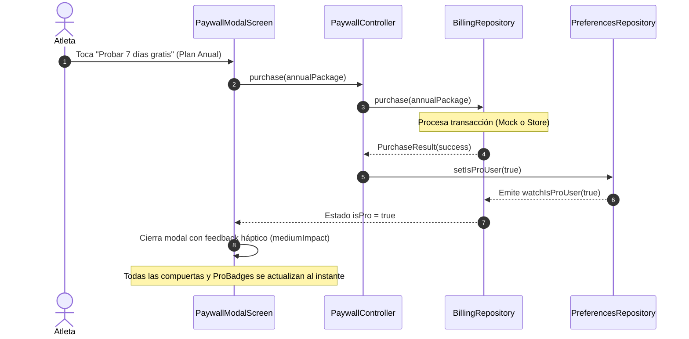

# Design: Capa Pro / Compras In-App (Freemium)

**ID:** F06 &nbsp;|&nbsp; **Slug:** `06-pro-tier-iap` &nbsp;|&nbsp; **Fase:** Fase 1 · Personalizacion

---

## Contexto y Principios de Diseño

Este documento define la arquitectura técnica para materializar la monetización freemium de `requirements.md` y `ANALISIS_MONETIZACION_FREEMIUM_F06.md`.
Sigue estrictamente la arquitectura hexagonal (**Ports & Adapters**), Riverpod 2.x, Drift SQLite y el Design System del proyecto.

### Principios rectores:
1. **Desacoplamiento total del proveedor de pagos:** Ni la UI ni el dominio conocen `in_app_purchase` ni Google Play. Todo interactúa contra la interfaz abstracta `BillingRepository`.
2. **First-class Fake Driver:** En entornos de desarrollo y pruebas, se inyecta `FakeBillingDriver` que permite simular compras, cancelaciones y alternar en tiempo real entre Free y Pro mediante un toggle en Ajustes.
3. **Persistencia local atómica y resiliencia offline:** El derecho adquirido (`is_pro = true`) se respalda en Drift SQLite (`app_preferences`). Un atleta Pro nunca pierde acceso sin conexión a internet.
4. **Cero parches en compuertas:** Las restricciones de creación (máximo 3 rutinas) y personalización se validan a nivel de controlador/repositorio, no mediante hacks visuales en la vista.

---

## Arquitectura de Capas (Ports & Adapters)

```
┌────────────────────────────────────────────────────────┐
│                   PRESENTATION LAYER                   │
│  [PaywallModalScreen] [ProBadge] [DeveloperSettings]   │
└───────────────────────────▲────────────────────────────┘
                            │
┌───────────────────────────┴────────────────────────────┐
│                    APPLICATION LAYER                   │
│  [isProUserProvider] [PaywallController] [ProGate]     │
└───────────────────────────▲────────────────────────────┘
                            │
┌───────────────────────────┴────────────────────────────┐
│                      DOMAIN LAYER                      │
│   [ProductPackage] [PurchaseResult] [Entitlement]      │
└───────────────────────────▲────────────────────────────┘
                            │
         ┌──────────────────┴──────────────────┐
         │                                     │
┌────────┴─────────────┐             ┌─────────┴────────────┐
│     DATA LAYER       │             │   ADAPTERS (MOCK/PROD)│
│ PreferencesRepository│             │ FakeBillingDriver (Dev)│
│ (Drift SQLite cache) │             │ InAppPurchase (Store) │
└──────────────────────┘             └──────────────────────┘
```

---

## Modelos de Dominio (`lib/features/pro_tier/domain/`)

### 1. `ProductPackage`
Modelo inmutable que describe cada opción disponible para el atleta:

```dart
enum BillingPeriod { monthly, annual, lifetime }

class ProductPackage {
  final String id; // e.g. 'interval_timer_pro_annual'
  final String title; // 'Anual'
  final String description; // '7 días gratis, luego $17.99 / año'
  final String priceFormatted; // '$17.99'
  final double priceNumeric; // 17.99
  final BillingPeriod period;
  final bool hasFreeTrial; // true para anual
  final int? discountPercentage; // 50 para anual
}
```

### 2. `PurchaseResult`
Representa el resultado de una operación de facturación:

```dart
enum PurchaseStatus { success, cancelled, pending, error }

class PurchaseResult {
  final PurchaseStatus status;
  final String? errorMessage;
}
```

---

## Contratos y Repositorios (`lib/features/pro_tier/data/`)

### Puerto Abstracto: `BillingRepository`

```dart
abstract class BillingRepository {
  Future<bool> isPro();
  Stream<bool> watchIsPro();
  Future<List<ProductPackage>> getAvailableProducts();
  Future<PurchaseResult> purchase(ProductPackage package);
  Future<PurchaseResult> restorePurchases();
  
  // Soporte exclusivo para modo de prueba/desarrollo:
  bool get isMockDriver;
  Future<void> toggleMockPro(bool enable);
}
```

### Adaptador de Desarrollo: `FakeBillingDriver`
- Almacena el estado inicial en memoria sincronizado con `PreferencesRepository`.
- Expone un catálogo estático de 3 productos curados:
  - **Mensual:** `$2.99 / mes`
  - **Anual:** `$17.99 / año` (`hasFreeTrial: true`, `discountPercentage: 50`)
  - **Lifetime:** `$29.99` (pago único)
- Permite forzar éxito, cancelación o fallo para testing determinístico.
- Permite alternar `toggleMockPro(bool)` instantáneamente sin tocar SQLite si se desea modo volátil.

### Persistencia SQLite (`PreferencesRepository`)
- Llave agregada: `static const isProUserKey = 'is_pro_user';`
- Métodos atómicos:
  - `Future<bool> isProUser()` (default: `false`)
  - `Future<void> setIsProUser(bool value)`
  - `Stream<bool> watchIsProUser()`

---

## Capa de Aplicación y Estado (`lib/features/pro_tier/application/`)

### 1. `isProUserProvider`
StreamProvider reactivo que expone el estado actual del usuario:

```dart
final isProUserProvider = StreamProvider<bool>((ref) {
  final billingRepo = ref.watch(billingRepositoryProvider);
  return billingRepo.watchIsPro();
});
```

### 2. `PaywallController`
Controlador para orquestar la compra y restauración de suscripciones:

```dart
class PaywallController extends AutoDisposeAsyncNotifier<void> {
  Future<PurchaseResult> purchase(ProductPackage package);
  Future<PurchaseResult> restorePurchases();
}
```

### 3. `canCreateWorkoutProvider`
Evalúa la compuerta de creación de entrenamientos:

```dart
final canCreateWorkoutProvider = Provider<bool>((ref) {
  final isPro = ref.watch(isProUserProvider).valueOrNull ?? false;
  if (isPro) return true;
  
  final workoutsCount = ref.watch(customWorkoutsCountProvider);
  return workoutsCount < 3;
});
```

---

## Capa de Presentación (`lib/features/pro_tier/presentation/`)

### 1. `ProBadge`
Badge sutil en ámbar/oro metálico con el Design System:
- Dimensiones: 16-20dp de alto, tipografía `labelSmall` en negrita con espaciado 1.0.
- Si `isPro == true`, se oculta automáticamente.
- Reutilizable en `PhaseColorPicker`, `TimerAudioControlsSheet`, `WorkoutEditorScreen` y tarjetas de rutinas.

### 2. `PaywallModalScreen`
Desplegado mediante `showModalBottomSheet` a pantalla completa o ruta `/paywall`:
- **Header:** Icono de corona o llama dorada procedural en `AppTheme.accentColorPresets`.
- **Carrusel de Beneficios:**
  1. Rutinas ilimitadas (libérate del límite de 3 rutinas).
  2. Experiencia 100% limpia sin anuncios intersticiales.
  3. Audio Ducking inteligente con Spotify y Apple Music.
  4. Selector de colores de fase ergonómicos con vista en mockup.
  5. Notas ilimitadas de sensaciones y pesos en calendario.
- **Selector de Planes:** Tarjetas seleccionables destacando la opción Anual con etiqueta "Ahorra 50% - 7 días gratis".
- **Botón CTA Primario:** Animación de escala sutil al pulsar.
- **Enlace "Restaurar Compras" y Términos:** Cumple estrictamente con las políticas de Google Play Store y Apple App Store.
- **Defensa ante `isPro == true`:** Si se despliega cuando el usuario ya cuenta con Pro activo, conmuta automáticamente a la vista de estado activo (`ProStatusModalSheet`) evitando presentar opciones de compra.

### 3. `ProStatusModalSheet` (Gestión de Suscripción Activa)
Desplegado mediante `showModalBottomSheet` desde la tarjeta de Ajustes (`_ProCard`) cuando `isPro == true`:
- **Encabezado:** Badge Pro dorado/ámbar con `Icons.verified_rounded` y título *"Pro Activo"*.
- **Subtítulo:** Confirmación de membresía y acceso ilimitado a todas las funciones premium.
- **Resumen de Beneficios:** Lista visual de las 6 ventajas activas (Rutinas ilimitadas, Medidas y métricas corporales, Cero anuncios, Clips SFX deportivos, Colores de fase ergonómicos y Soporte a desarrollo indie).
- **Acciones:**
  - Botón secundario/texto *"Administrar suscripción"* que orienta al usuario a gestionar su plan en Google Play Store / Apple App Store.
  - Botón primario *"Entendido"* para cerrar la hoja modal.

### 4. Switch de Depuración en `SettingsScreen`
- Visible únicamente cuando `kDebugMode || kProfileMode`.
- Componente `SwitchListTile` rotulado: `"Simular usuario Pro (Mock)"`.
- Al activarse/desactivarse, notifica a `BillingRepository.toggleMockPro(bool)`, actualizando la app de inmediato.

---

## Arquitectura Anti-Bypass y Resolución de Casos Borde

### 1. Compuerta de Nivel de Dominio/Repositorio (Anti-Bypass de Duplicación)
Para evitar que un usuario eluda el límite mediante atajos visuales (ej. menú de acciones contextuales, clonar desde catálogo de presets o atajos de teclado):
- Se define la excepción tipada `ProLimitReachedException`.
- En `WorkoutsListController.duplicateWorkout(id)` y `PresetDetailScreen._handleDuplicate()`:
  ```dart
  final canCreate = ref.read(canCreateWorkoutProvider);
  if (!canCreate) {
    // Abre el Paywall modal y aborta la transacción
    ref.read(paywallTriggerProvider.notifier).trigger(ProTriggerReason.workoutLimit);
    return;
  }
  ```
- De este modo, cualquier punto de entrada que intente insertar un 4to workout en la base de datos queda neutralizado antes de tocar SQLite.

### 2. Prevención de Condiciones de Carrera (Double-Tap Mutex)
- Los controladores `WorkoutEditorController` y `WorkoutsListController` implementan un flag síncrono `_isMutating`:
  - Se activa inmediatamente al recibir el primer evento de pulsación.
  - Ignora cualquier segundo evento que ocurra antes de que el Future de Drift SQLite complete.
  - La transacción de Drift evalúa el conteo total en una transacción atómica `db.transaction(() async { ... })`.

### 3. Política de Downgrade y Preservación de Entidades
- Las tablas locales de Drift (`workouts`, `routine_items`) **nunca** ejecutan borrados en cascada ante la pérdida del derecho Pro.
- Si un usuario tiene 8 rutinas y pasa a Free:
  - Todas las 8 rutinas se listan y son 100% ejecutables en el temporizador.
  - Se pueden editar los ejercicios y tiempos de esas 8 rutinas.
  - La compuerta `canCreateWorkoutProvider` evalúa `8 < 3 == false`, bloqueando la creación de una 9na rutina hasta que el usuario borre rutinas hasta tener 2, o reactive Pro.

### 4. Fallback Seguro y No Destructivo en Personalizaciones
- En los getters de resolución de tema y audio:
  ```dart
  Color resolveWorkColor(AppSettings settings, bool isPro) {
    if (settings.workColorArgb != null && isPro) {
      return Color(settings.workColorArgb!);
    }
    return AppTheme.defaultWorkColor; // Verde esmeralda ergonómico
  }
  ```
- La preferencia del usuario se conserva intacta en SQLite; si el usuario se resuscribe, sus colores elegidos vuelven a activarse automáticamente sin reconfiguración.

---

## Diagrama de Secuencia: Flujo de Compra y Desbloqueo



---

## Riesgos y Mitigaciones

| Riesgo Técnico / Negocio | Mitigación Arquitectónica |
|---|---|
| Inconsistencia de estado tras cerrar la app | El estado se persiste atómicamente en SQLite antes de confirmar el resultado a la UI. |
| Falsos positivos por fallos de red en modo offline | La app consulta primero el caché local persistido; nunca bloquea al atleta Pro por falta de internet. |
| Complejidad de pruebas con cuentas sandbox reales | `FakeBillingDriver` desacopla completamente el desarrollo diario de las tiendas de aplicaciones. |
| Elusión de límite de 3 rutinas al duplicar presets | Validación obligatoria en `WorkoutsListController` y `PresetDetailScreen` antes de insertar. |


