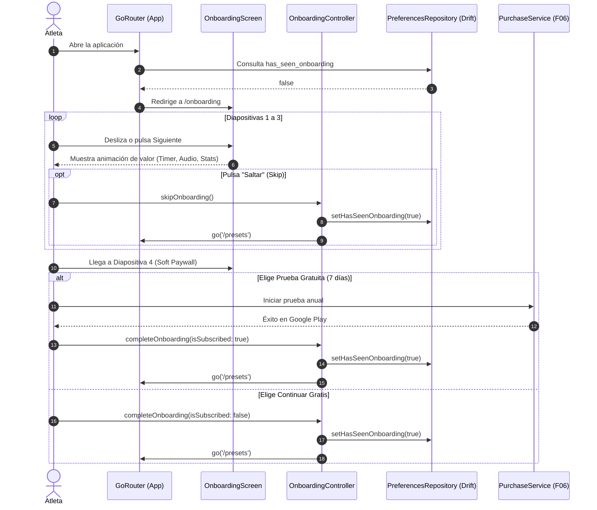

# Design: Onboarding

**ID:** F30 &nbsp;|&nbsp; **Slug:** `30-onboarding` &nbsp;|&nbsp; **Fase:** Fase 7 · Calidad y Pulido

---

## Contexto y Principios

Este documento describe el diseño técnico y arquitectónico para implementar `requirements.md` (F30).
Se adhiere estrictamente a:
- `_global/01-vision-and-principles.md` (El loop central es sagrado; el onboarding educa sin bloquear).
- `_global/02-architecture-and-structure.md` (Clean Architecture + DDD, Riverpod como única fuente de estado).
- `_global/04-design-system.md` (Tokens semánticos de color, tipografía y componentes vivos).
- `_global/05-data-model.md` (Persistencia mediante Drift SQLite y `PreferencesRepository`).
- `ANALISIS_MONETIZACION_FREEMIUM_F06.md` (Integración de Soft Paywall desacoplado con `PurchaseService`).

---

## Arquitectura del Módulo (`lib/features/onboarding/`)

Siguiendo las convenciones de Screaming Architecture del proyecto, la feature se ubica en su propio módulo:

```
lib/features/onboarding/
├── application/
│   ├── onboarding_controller.dart         # Controla navegación entre páginas y finalización
│   └── onboarding_providers.dart          # hasSeenOnboardingProvider, onboardingCurrentPageProvider
├── domain/
│   └── onboarding_slide.dart              # Value object inmutable con contenido y tipo de diapositiva
└── presentation/
    ├── onboarding_screen.dart             # Pantalla raíz con PageView, Header, Indicadores y CTAs
    └── widgets/
        ├── onboarding_hero_graphic.dart   # Widgets visuales vivos (Timer Ring, Audio Waves, Badges)
        ├── onboarding_page_indicator.dart # Dots indicator animado según Design System
        ├── onboarding_skip_button.dart    # Botón "Saltar" en el header superior derecho
        └── onboarding_paywall_card.dart   # Tarjeta de conversión Pro (Soft Paywall con Free Trial)
```

---

## Persistencia y Modelo de Datos

El estado de visualización del onboarding se almacena en la tabla SQLite existente `app_preferences` a través de [PreferencesRepository](file:///D:/MCP2_DISCO_2/PROGRAMACION/XAMPP/htdocs/PROYECTOS%20PROGRAMACION/Flutter/interval_timer/lib/data/repositories/preferences_repository.dart):

```dart
// Clave persistente en PreferencesRepository
static const hasSeenOnboardingKey = 'has_seen_onboarding';
static const defaultHasSeenOnboarding = false;

// Métodos de lectura y escritura
Future<bool> hasSeenOnboarding() async {
  final val = await getPreference(hasSeenOnboardingKey);
  return val == 'true';
}

Future<void> setHasSeenOnboarding(bool value) async {
  await setPreference(hasSeenOnboardingKey, value ? 'true' : 'false');
}
```

---

## Gestión de Estado (Riverpod)

```dart
// Provider que expone si el usuario ya vio el onboarding
final hasSeenOnboardingProvider = FutureProvider<bool>((ref) async {
  final repo = ref.watch(preferencesRepositoryProvider);
  return repo.hasSeenOnboarding();
});

// Controller para gestionar el avance del onboarding
class OnboardingController extends AutoDisposeAsyncNotifier<void> {
  @override
  FutureOr<void> build() {}

  Future<void> completeOnboarding({required bool isSubscribed}) async {
    state = const AsyncLoading();
    state = await AsyncValue.guard(() async {
      final repo = ref.read(preferencesRepositoryProvider);
      await repo.setHasSeenOnboarding(true);
      // Invalida el provider para que el router y la UI reaccionen
      ref.invalidate(hasSeenOnboardingProvider);
    });
  }
}

final onboardingControllerProvider =
    AutoDisposeAsyncNotifierProvider<OnboardingController, void>(
  OnboardingController.new,
);
```

---

## Enrutamiento y Guard en `GoRouter` (`lib/app/router.dart`)

El onboarding debe mostrarse únicamente en el primer inicio de la app y no debe ser accesible una vez completado:

1. **Ruta Raíz Fuera del Shell:** `/onboarding` se registra como una ruta de pantalla completa en `_rootNavigatorKey`, sin mostrar el `BottomNavigationBar` de la app principal.
2. **Lógica de Redirección (Guard Reactivo):**

```dart
redirect: (context, state) {
  final hasSeenOnboardingAsync = ref.read(hasSeenOnboardingProvider);
  final hasSeen = hasSeenOnboardingAsync.asData?.value ?? true; // Default seguro mientras resuelve
  final location = state.matchedLocation;

  // 1. Prioridad: ejecución o completado del timer (F01/F35)
  // ... (se preservan los guards de ejecución activa) ...

  // 2. Redirección inicial a Onboarding si no se ha completado
  if (!hasSeen && location != '/onboarding') {
    return '/onboarding';
  }

  // 3. Si ya se vio y el usuario intenta acceder manualmente a /onboarding, redirige a home
  if (hasSeen && location == '/onboarding') {
    return '/';
  }

  return null;
}
```

---

## Diagrama de Flujo y Ciclo de Vida



---

## Componentes Visuales del Design System (Sin PNGs pesados)

Para cumplir con la directiva de cero imágenes rasterizadas estáticas:

- **Slide 1 (Timer & Workouts):** Instancia una versión compacta no interactiva de `CountdownRing` con arcos coloreados en `AppTheme.workColor` y `AppTheme.restColor`, demostrando visualmente el motor de intervalos.
- **Slide 2 (Audio & Ducking):** Renderizado de ondas sonoras estilizadas (`CustomPainter` o animación con `AnimatedBuilder`) junto con iconos semánticos de altavoz, micrófono TTS y logo de música atenuada.
- **Slide 3 (Métricas & Logros):** Card estilizada basada en el diseño de `SessionSummaryCard`, mostrando un chip de racha ("🔥 3 días"), un contador de calorías ("240 kcal") y una medalla de logro dorada (`Icons.emoji_events`).
- **Slide 4 (Soft Paywall Card):** Card premium con badge "PRO", lista de bullets con checkmarks verdes, selector destacado de la prueba de 7 días (`$17.99/año`) y botón principal en Solar Orange (`AppTheme.primaryColor`).

---

## Riesgos Técnicos y Mitigaciones

| Riesgo | Impacto | Estrategia de Mitigación |
|---|---|---|
| Parpadeo en GoRouter durante el arranque inicial al consultar Drift SQLite de forma asíncrona. | Medio | Precargar las preferencias durante la inicialización de `main.dart` o inicializar `hasSeenOnboardingProvider` antes de inflar el árbol de GoRouter, garantizando valor sincrónico disponible en el primer frame. |
| Inestabilidad o timeout en la consulta de ofertas de Google Play / RevenueCat en la diapositiva 4. | Alto | Degradación suave: la card muestra la oferta base en caché o modo fallback, y el botón "Continuar con versión gratuita" siempre permanece completamente habilitado y funcional (R13). |
| Usuario cierra la app a mitad de la diapositiva 2. | Bajo | Conforme a la regla D5, `setHasSeenOnboarding(true)` **nunca** se ejecuta al entrar ni en transiciones intermedias; solo se persiste ante acción explícita de salida (Skip, Continuar o Suscribirse). |

---

## Alternativas Consideradas y Descartadas

1. **Hard Paywall bloqueante en la diapositiva 4:** Descartado categóricamente. Violaría los principios rectores de `ANALISIS_MONETIZACION_FREEMIUM_F06.md`, reduciendo drásticamente la tasa de retención de nuevos usuarios y generando quejas en Google Play.
2. **Uso de paquete de onboarding de terceros (`introduction_screen`):** Descartado. Agrega dependencias transitivas innecesarias, limita la personalización de widgets vivos del Design System y rompe la coherencia visual con nuestras animaciones y temas.
3. **Navegar a la pantalla principal vacía (`/`) tras completar:** Descartado. Aterrizar en `/presets` reduce la fricción hacia la primera sesión completada (activación temprana).
