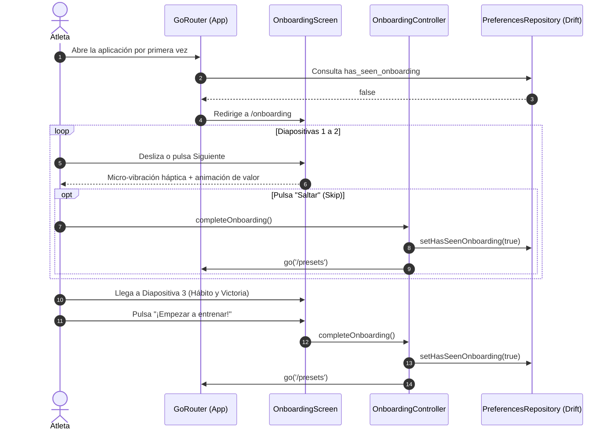

# Design: Onboarding

**ID:** F30 &nbsp;|&nbsp; **Slug:** `30-onboarding` &nbsp;|&nbsp; **Fase:** Fase 7 · Calidad y Pulido

---

## Contexto y Principios de Diseño

Este documento define la arquitectura técnica y los estándares de interacción visual para implementar `requirements.md` (F30).
Se fundamenta en:
- `_global/01-vision-and-principles.md`: El loop central es sagrado; el onboarding educa e inspira sin imponer barreras.
- `_global/02-architecture-and-structure.md`: Clean Architecture + DDD, Riverpod como única fuente reactiva de estado.
- `_global/04-design-system.md`: Tokens semánticos, tipografía atlética, paleta de colores y componentes interactivos vivos.
- `_global/05-data-model.md`: Persistencia atómica mediante Drift SQLite y `PreferencesRepository`.

---

## Arquitectura del Módulo (`lib/features/onboarding/`)

Siguiendo las convenciones de arquitectura modular por features:

```
lib/features/onboarding/
├── application/
│   ├── onboarding_controller.dart         # Controla navegación, cambio de página y finalización
│   └── onboarding_providers.dart          # hasSeenOnboardingProvider, onboardingCurrentPageProvider
├── domain/
│   └── onboarding_slide_data.dart         # Value object inmutable con textos, etiquetas y configuración visual
└── presentation/
    ├── onboarding_screen.dart             # Pantalla raíz inmersiva (PageView, Header, Indicador y CTAs)
    └── widgets/
        ├── onboarding_page_indicator.dart # Indicador de píldora expandible con animación desacelerada
        ├── onboarding_skip_button.dart    # Botón sutil "Saltar" en el header superior
        └── slides/
            ├── timer_showcase_slide.dart  # Slide 1: CountdownRing animado con pulso rítmico
            ├── audio_showcase_slide.dart  # Slide 2: Ecualizador de ondas animadas y badges flotantes
            └── progress_showcase_slide.dart # Slide 3: Card de hábitos, racha activa y medalla dorada
```

---

## Persistencia y Modelo de Datos

La finalización del onboarding se registra en la tabla `app_preferences` a través de [PreferencesRepository](file:///D:/MCP2_DISCO_2/PROGRAMACION/XAMPP/htdocs/PROYECTOS%20PROGRAMACION/Flutter/interval_timer/lib/data/repositories/preferences_repository.dart):

```dart
// Clave persistente en PreferencesRepository
static const hasSeenOnboardingKey = 'has_seen_onboarding';
static const defaultHasSeenOnboarding = false;

// Métodos de lectura y escritura
Future<bool> hasSeenOnboarding() async {
  final val = await getPreference(hasSeenOnboardingKey);
  return val == 'true';
}

Future<void> setHasSeenOnboarding(bool value) async {
  await setPreference(hasSeenOnboardingKey, value ? 'true' : 'false');
}
```

---

## Gestión de Estado Reactivo (Riverpod)

```dart
// Provider que expone si el usuario ya completó el onboarding
final hasSeenOnboardingProvider = FutureProvider<bool>((ref) async {
  final repo = ref.watch(preferencesRepositoryProvider);
  return repo.hasSeenOnboarding();
});

// Provider para el índice de página actual
final onboardingPageProvider = StateProvider.autoDispose<int>((ref) => 0);

// Controller para orquestar la navegación y cierre
class OnboardingController extends AutoDisposeAsyncNotifier<void> {
  @override
  FutureOr<void> build() {}

  Future<void> completeOnboarding() async {
    state = const AsyncLoading();
    state = await AsyncValue.guard(() async {
      final repo = ref.read(preferencesRepositoryProvider);
      await repo.setHasSeenOnboarding(true);
      ref.invalidate(hasSeenOnboardingProvider);
    });
  }
}

final onboardingControllerProvider =
    AutoDisposeAsyncNotifierProvider<OnboardingController, void>(
  OnboardingController.new,
);
```

---

## Enrutamiento y Guard en `GoRouter` (`lib/app/router.dart`)

1. **Ruta Raíz Fuera del Shell:** `/onboarding` se registra en `_rootNavigatorKey`, presentando una experiencia inmersiva a pantalla completa sin barra inferior de navegación.
2. **Redirección Reactiva:**

```dart
redirect: (context, state) {
  final hasSeenOnboardingAsync = ref.read(hasSeenOnboardingProvider);
  final hasSeen = hasSeenOnboardingAsync.asData?.value ?? true; // Default seguro mientras resuelve
  final location = state.matchedLocation;

  // 1. Prioridad: ejecución o completado del timer (F01/F35)
  // ... (guards activos del temporizador) ...

  // 2. Redirección inicial a Onboarding si no se ha completado
  if (!hasSeen && location != '/onboarding') {
    return '/onboarding';
  }

  // 3. Si ya se vio y el usuario intenta entrar a /onboarding, redirige a inicio
  if (hasSeen && location == '/onboarding') {
    return '/';
  }

  return null;
}
```

---

## Diagrama de Flujo y Ciclo de Vida



---

## Estándares de Diseño Visual Premium y Micro-interacciones

1. **Gradiente de Fondo Inmersivo:**
   - Gradiente radial sutil que combina carbón profundo (`#121212` en dark mode) con un suave tinte difuminado del acento primario (Solar Orange `#FF6B00` al 6% de opacidad) en el tercio superior, aportando tridimensionalidad.
2. **Slide 1 — Precisión & Timer Core:**
   - Miniatura animada del `CountdownRing` con arcos coloreados en `AppTheme.workColor` (verde esmeralda) y `AppTheme.restColor` (ámbar cálido).
   - Animación de respiración suave (pulso de escala de 0.98 a 1.02) que simula el latido rítmico del entrenamiento.
3. **Slide 2 — Inmersión Sonora & Enfoque:**
   - Visualizador de ecualizador con barras verticales simétricas que oscilan en bucle armónico con curvas senoidales independientes.
   - Badges flotantes con acabado translúcido (*frosted glass* con `BackdropFilter` o `Container` con borde tenue) destacando: "Voz en off", "SFX de Boxeo" y "Atenuación Spotify".
4. **Slide 3 — Hábito, Progreso & Logros:**
   - Tarjeta estilizada con borde acentuado mostrando:
     - Medalla dorada reluciente (`Icons.emoji_events`) con sutil efecto de resplandor.
     - Chip de racha en llamas ("🔥 3 días seguidos").
     - Métrica de energía activa ("250 kcal").
   - Botón CTA principal de gran escala: alto contraste, bordes redondeados (16dp), elevación sutil y feedback háptico `HapticFeedback.mediumImpact()`.
5. **Indicador de Píldora Animada (`OnboardingPageIndicator`):**
   - Diapositivas inactivas: círculos de 8dp de diámetro con opacidad reducida (30%).
   - Diapositiva activa: se expande a una píldora de 28dp de ancho con el color de acento principal (`AppTheme.primaryColor`), animada con `Curves.easeOutCubic` en 300ms.

---

## Riesgos Técnicos y Mitigaciones

| Riesgo | Impacto | Estrategia de Mitigación |
|---|---|---|
| Parpadeo visual en GoRouter al consultar Drift asíncronamente en el arranque. | Medio | Precargar las preferencias en `main.dart` antes de que el árbol de GoRouter ejecute su primer ciclo de redirección, o proveer valor de respaldo sincronizado. |
| Caída de frames (jank) en transiciones de página en teléfonos de gama baja. | Bajo | Cero shaders complejos o blur excesivo; animaciones calculadas con `Transform` y `AnimatedBuilder` optimizadas para composición por hardware en GPU. |
| Usuario fuerza el cierre de la app durante la diapositiva 2. | Bajo | El flag `has_seen_onboarding` **nunca** se persiste prematuramente. Si se aborta el flujo, el onboarding se presenta de nuevo en la siguiente apertura (R12). |

---

## Alternativas Consideradas y Descartadas

1. **Acoplar pantalla de Paywall Pro de F06 en este momento:** Descartado categóricamente. F06 aún no existe en código. Introduciría mocks innecesarios o dependencias fantasmas. La monetización se integrará en compuertas de producto orgánicas cuando F06 sea construida.
2. **Imágenes estáticas o GIFs pre-renderizados:** Descartado. Aumentan el peso de la app, se distorsionan en pantallas panorámicas o tabletas y no responden dinámicamente a la paleta ni al modo oscuro.
3. **Navegar a la pantalla de inicio vacía (`/`):** Descartado. Redirigir a `/presets` asegura que el atleta pueda comenzar un entrenamiento predefinido en menos de 10 segundos.
