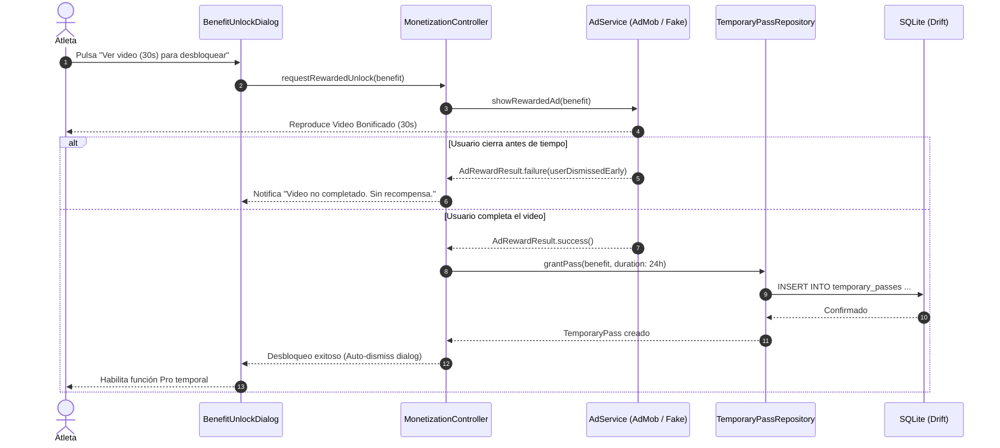

# Design: Publicidad y Anuncios Bonificados (Rewarded Ads & AdMob)

**ID:** F37 &nbsp;|&nbsp; **Slug:** `37-rewarded-ads-and-monetization` &nbsp;|&nbsp; **Fase:** Fase 2 · Monetización y Anuncios

---

## Contexto y Principios de Diseño

Este documento especifica el diseño técnico detallado para la capa publicitaria ética de la aplicación, complementando la infraestructura Pro de F06 conforme a las definiciones de `ANALISIS_F37_PUBLICIDAD_Y_REWARDED_ADS.md` y `requirements.md`.

### Principios Rectores:
1. **Ports & Adapters (Hexagonal Architecture):** El dominio y la UI desconocen absolutamente la existencia del SDK de `google_mobile_ads`. Todas las operaciones de carga y muestra de anuncios se coordinan a través de la interfaz abstracta `AdService`.
2. **TDD Estricto (Test-Driven Development):** Todo el comportamiento de pases temporales, control de caducidad, límites diarios y cooldowns se desarrolla escribiendo los tests unitarios y de estado primero. Se implementa un `FakeAdService` de primera clase para garantizar una suite de tests determinista y 100% offline.
3. **Protocolo RDD (Receipt-Driven Development):** Conforme a las directivas de `AGENTS.md`, la verificación final de esta feature se realiza orquestando un subagente ciego (`invoke_subagent`) sin historial de conversación que audita el diff congelado bajo el lente `review-reliability` para garantizar cero regresiones y ausencia total de parches.
4. **Cero Pérdida de Datos (Zero Data Loss):** La caducidad de un beneficio temporal conmuta estados (ej. marcar rutina como archivada o conmutar SFX al beep estándar), pero jamás destruye ni borra entidades en la base de datos local SQLite.
5. **Defensa contra Manipulación de Reloj (Anti-Tampering):** Registro de marcas de agua UTC y cotejo con el reloj monotónico del sistema (`elapsedRealtime`) para mitigar manipulaciones locales de fecha.

---

## Arquitectura de Capas

```
┌────────────────────────────────────────────────────────┐
│                   PRESENTATION LAYER                   │
│   [BenefitUnlockDialog] [CooldownTimerBadge]           │
│   [RewardedBenefit]     [MonetizationController]       │
└───────────────────────────▲────────────────────────────┘
                            │
┌───────────────────────────┴────────────────────────────┐
│                    APPLICATION LAYER                   │
│   [isBenefitUnlockedProvider] [dailyCapTrackerProvider]│
│   [activeTemporaryPassesProvider] [adServiceProvider]  │
└───────────────────────────▲────────────────────────────┘
                            │
┌───────────────────────────┴────────────────────────────┐
│                      DOMAIN LAYER                      │
│   [RewardedBenefit] [TemporaryPass] [AdRewardResult]   │
│   [DailyCapPolicy]  [AdCooldownPolicy]                 │
└───────────────────────────▲────────────────────────────┘
                            │
         ┌──────────────────┴──────────────────┐
         │                                     │
┌────────┴─────────────┐             ┌─────────┴────────────┐
│     DATA LAYER       │             │ INFRASTRUCTURE LAYER │
│ TemporaryPassRepository            │ FakeAdService (Dev/TDD)
│ (Drift SQLite Table) │             │ AdMobAdService (SDK)  │
└──────────────────────┘             └──────────────────────┘
```

---

## Modelos de Dominio (`lib/features/monetization/domain/`)

### 1. `RewardedBenefit` (Enum)
Define el catálogo oficial de beneficios temporales que un usuario puede desbloquear mediante anuncios bonificados en el MVP de F37:

```dart
enum RewardedBenefit {
  /// +1 slot de rutina creada en WorkoutBuilder (F32).
  extraWorkoutSlot(Duration(hours: 24)),

  /// Catálogo Pro de clips de sonido deportivo en SoundService (F36).
  proAudioPass(Duration(hours: 12)),

  /// Paleta libre de personalización de fases de color (F06).
  phaseColorsPass(Duration(hours: 24)),

  /// Acceso a historial extendido y medidas corporales en F15.
  bodyTrackingPass(Duration(hours: 24)),

  /// Supresión de anuncios intersticiales post-entrenamiento.
  adFreePass(Duration(hours: 24));

  // NOTA: exportDataPass queda postergada a Fase 7 (F29) y excluida del MVP.

  final Duration defaultDuration;
  const RewardedBenefit(this.defaultDuration);
}
```

### 2. `TemporaryPass` (Entidad)
Modelo inmutable que representa un derecho adquirido de forma temporal:

```dart
class TemporaryPass {
  final String id;
  final RewardedBenefit benefit;
  final DateTime grantedAtUtc;
  final DateTime expiresAtUtc;

  const TemporaryPass({
    required this.id,
    required this.benefit,
    required this.grantedAtUtc,
    required this.expiresAtUtc,
  });

  bool isExpired([DateTime? referenceTimeUtc]) {
    final now = referenceTimeUtc ?? DateTime.now().toUtc();
    return now.isAfter(expiresAtUtc);
  }

  Duration remainingTime([DateTime? referenceTimeUtc]) {
    final now = referenceTimeUtc ?? DateTime.now().toUtc();
    if (now.isAfter(expiresAtUtc)) return Duration.zero;
    return expiresAtUtc.difference(now);
  }
}
```

### 3. `AdRewardResult` (Value Object)
Resultado inmutable retornado tras el intento de visualización de un anuncio:

```dart
enum AdRewardStatus {
  rewardEarned,
  userDismissedEarly,
  adNotAvailable,
  rateLimitExceeded,
  error,
}

class AdRewardResult {
  final AdRewardStatus status;
  final String? errorMessage;

  const AdRewardResult.success()
      : status = AdRewardStatus.rewardEarned,
        errorMessage = null;

  const AdRewardResult.failure(this.status, [this.errorMessage]);
}
```

---

## Esquema de Base de Datos Drift SQLite (`lib/core/database/tables/`)

Se añade la tabla de pases temporales `temporary_passes.dart` en la base de datos central Drift:

```dart
import 'package:drift/drift.dart';

class TemporaryPassesTable extends Table {
  TextColumn get id => text()();
  TextColumn get benefitType => text()(); // RewardedBenefit.name
  DateTimeColumn get grantedAtUtc => dateTime()();
  DateTimeColumn get expiresAtUtc => dateTime()();
  TextColumn get source => text().withDefault(const Constant('rewarded_ad'))();

  @override
  Set<Column> get primaryKey => {id};
}

class AdMetadataTable extends Table {
  TextColumn get key => text()(); // e.g. 'last_interstitial_shown_utc', 'max_verified_utc'
  TextColumn get value => text()();

  @override
  Set<Column> get primaryKey => {key};
}
```

---

## Contrato de Infraestructura: Puerto `AdService`

```dart
abstract interface class AdService {
  /// Inicializa los drivers o SDKs subyacentes.
  Future<void> initialize();

  /// Consulta si hay un video bonificado disponible para mostrar.
  Future<bool> isRewardedAdReady();

  /// Precarga un anuncio bonificado en segundo plano.
  Future<void> preloadRewardedAd();

  /// Muestra el video bonificado. Retorna [AdRewardResult.success] si se completó.
  Future<AdRewardResult> showRewardedAd(RewardedBenefit benefit);

  /// Evalúa el cooldown y, si corresponde, muestra un anuncio intersticial.
  Future<void> showInterstitialIfEligible();
}
```

### Adaptador de Desarrollo y Testing (`FakeAdService`)
Permite inyectar latencias simuladas, simular cierres tempranos de video o forzar estados de *no-fill* para validar exhaustivamente la robustez de los widgets y providers mediante TDD:

```dart
class FakeAdService implements AdService {
  bool isReady = true;
  bool shouldUserCompleteAd = true;
  Duration simulatedDuration = Duration.zero;

  @override
  Future<AdRewardResult> showRewardedAd(RewardedBenefit benefit) async {
    if (!isReady) {
      return const AdRewardResult.failure(AdRewardStatus.adNotAvailable);
    }
    if (simulatedDuration > Duration.zero) {
      await Future<void>.delayed(simulatedDuration);
    }
    if (shouldUserCompleteAd) {
      return const AdRewardResult.success();
    }
    return const AdRewardResult.failure(AdRewardStatus.userDismissedEarly);
  }
  // ...
}
```

---

## Capa de Aplicación y Estado Riverpod (`lib/features/monetization/application/`)

### 1. `isBenefitUnlockedProvider`
Evalúa si un beneficio está activo, unificando la jerarquía de Pro permanente frente a pases temporales:

```dart
final isBenefitUnlockedProvider = Provider.family<bool, RewardedBenefit>((ref, benefit) {
  // 1. Jerarquía Suprema: Si es Pro, todo está desbloqueado.
  final isPro = ref.watch(isProUserProvider).valueOrNull ?? false;
  if (isPro) return true;

  // 2. Evaluación de Pases Temporales Activos en SQLite.
  final activePasses = ref.watch(activeTemporaryPassesProvider).valueOrNull ?? [];
  return activePasses.any((pass) => pass.benefit == benefit && !pass.isExpired());
});
```

### 2. `DailyCapTracker` y Políticas de Control
Controla que un usuario no pueda consumir más de 2 videos por ciclo de 24 horas:

```dart
final dailyRewardedAdCountProvider = Provider<int>((ref) {
  final history = ref.watch(rewardedAdsHistoryProvider).valueOrNull ?? [];
  final now = DateTime.now().toUtc();
  final last24Hours = now.subtract(const Duration(hours: 24));
  return history.where((timestamp) => timestamp.isAfter(last24Hours)).length;
});

final canWatchRewardedAdProvider = Provider<bool>((ref) {
  final count = ref.watch(dailyRewardedAdCountProvider);
  return count < 2;
});
```

---

## Diagrama de Secuencia: Flujo de Desbloqueo y Validación



---

## Componentes de Presentación UI

### 1. `BenefitUnlockDialog` (Modal Reutilizable Contextual)
Componente modular que se invoca ante cualquier intento de acción Pro:
- **Cabecera:** Icono representativo del beneficio + Título claro (*"Desbloquear Silbato Pro"*).
- **Opción Principal:** Botón de alto contraste *"Obtener Pro Ilimitado"* (abre `PaywallModalScreen`).
- **Opción Secundaria:** Botón outlined con icono de video *"O mirar un video (30s) para probar por [X]h"*.
- **Estado Bloqueado / Cooldown:** Si se alcanzó el límite diario (2/2) o está offline, el botón secundario se deshabilita con texto explicativo.

### 2. Integración en `SessionCompleteScreen` (Intersticial)
Al tocar "Listo":
1. Comprueba si `isBenefitUnlockedProvider(RewardedBenefit.adFreePass) == true` o `isPro == true`.
2. Si está libre de anuncios, navega inmediatamente a la vista principal.
3. Si no, invoca `adService.showInterstitialIfEligible()`. Si pasaron $\ge 10$ minutos desde el último intersticial, lo muestra y luego completa la navegación.

---

## Estrategia de Testing (TDD) y Protocolo RDD

### 1. Suite TDD Requerida
- `temporary_pass_test.dart`: Validación de expiración, cálculo de tiempo remanente y parsing inmutable.
- `temporary_pass_repository_test.dart`: Inserción atómica en SQLite, purga de pases vencidos y verificación de marcas de agua contra manipulación de reloj.
- `daily_cap_tracker_test.dart`: Restricción estricta de 2 videos cada 24 horas y cooldown de 15 minutos entre anuncios.
- `is_benefit_unlocked_provider_test.dart`: Verificación de precedencia jerárquica (Pro permanente vence a pases temporales; fallback elegante ante expiración).
- `benefit_unlock_dialog_widget_test.dart`: Renderizado accesible, estados deshabilitados en offline / cap alcanzado y respuesta al callback de visualización.

### 2. Directivas del Subagente Ciego RDD (Receipt-Driven Development)
Antes de fusionar la rama `feature/37-rewarded-ads-and-monetization`, se ejecutará un subagente ciego adversarial con las siguientes instrucciones:
- **Lente:** `review-reliability` & `review-security`.
- **Entrada:** Diff congelado exclusivo de la rama (`git diff develop...HEAD`).
- **Criterios de Bloqueo Inmediato:**
  1. Presencia de llamadas al SDK de AdMob fuera de `lib/features/monetization/infrastructure/`.
  2. Ausencia de pruebas para la manipulación de reloj local o bypass de pases temporales.
  3. Lógica destructiva que borre rutinas o mutaciones forzadas en la base de datos al expirar pases.
  4. Intersticiales que se disparen sin verificar el cooldown técnico de 10 minutos.
